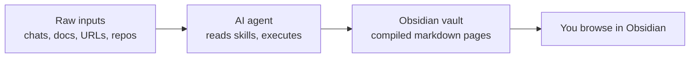
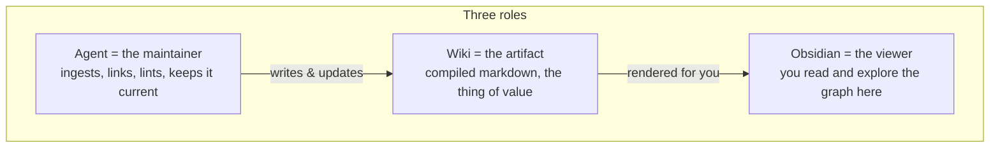

# Module 1.1: What is obsidian-wiki

> **Goal**: Understand what obsidian-wiki is in one sentence, what it deliberately is not, and the three-role framing that makes the whole system click.

---

## The One-Sentence Definition

obsidian-wiki is a skill-based framework for building and maintaining an Obsidian knowledge base with any AI coding agent. It implements Andrej Karpathy's "LLM Wiki" pattern: knowledge is **compiled** into interconnected markdown pages once, then maintained over time, instead of being retrieved fresh from a language model on every query.

The key word is **framework**. obsidian-wiki gives you a set of instructions (called skills) plus one installer script. The instructions tell an AI agent how to turn messy inputs into a clean, linked set of notes. The agent does the work; the framework only describes the work.

---

## What It Is (and Isn't)

### What it is

obsidian-wiki is a bundle of markdown instruction files plus a single Bash installer (`setup.sh`). The installer wires those instruction files into every supported AI agent's discovery path, so the same skill set works in Claude Code, Cursor, Codex, and more.

| Part | What it is |
|---|---|
| Skills | Markdown files at `.skills/<name>/SKILL.md` — the instructions the agent follows step by step |
| `setup.sh` | A Bash script that symlinks the skills into each agent's skill directory |
| `AGENTS.md` | The canonical context file: routing table, vault layout, core principles |
| Your vault | A plain Obsidian directory where compiled knowledge lives |

### What it isn't

This is the part that surprises people. obsidian-wiki is **not an application**. There is no software running in the background.

| Not this | Why |
|---|---|
| No runtime | Skills are read and executed by the host AI agent — nothing of obsidian-wiki's own ever runs |
| No API server | There is no service to call; the agent already has model access built in |
| No build step | Markdown needs no compile, bundle, or package step |
| No package manifest | There is no `package.json`, `go.mod`, or `requirements.txt` — the repo declares no runtime dependencies because it has no runtime |

The repo is markdown and a little Bash. That is the whole tech stack. The agent supplies the intelligence; the vault supplies the storage; obsidian-wiki supplies only the instructions in between.

---

## The Core Framing

Three roles make the system easy to reason about. Memorize this line:

> **The wiki is the artifact. The agent is the maintainer. Obsidian is the viewer.**

### The wiki is the artifact

The compiled pages in your vault are the product. They hold real value even when no agent is running. You can open them in Obsidian, search them, and read them like any other notes. The agent's job is to produce and improve this artifact — not to be queried directly.

### The agent is the maintainer

The AI agent reads the skill instructions and does the work: it ingests new sources, distills them into pages, adds `[[wikilinks]]` between related pages, fixes broken links, and keeps the index current. You decide what to add and what to ask; the agent handles the bookkeeping.

### Obsidian is the viewer

Obsidian renders the vault. It shows the graph view, follows wikilinks, and lets you browse. obsidian-wiki writes plain, valid Obsidian markdown so nothing is locked into a proprietary format — you could open the same files in any text editor.

---

## Key Takeaways

1. **Skill-based framework** - obsidian-wiki is a set of markdown instruction files plus one Bash installer, not an application.
2. **No runtime, no API, no build, no manifest** - the host AI agent supplies all execution; the framework only describes the work.
3. **Compile, don't retrieve** - knowledge is compiled once into linked pages and maintained, rather than regenerated by a model on every query.
4. **Three roles** - the wiki is the artifact, the agent is the maintainer, and Obsidian is the viewer.
5. **Portable storage** - the vault is plain Obsidian markdown, readable in any editor, with no proprietary lock-in.

---

## Next Module Preview

In **Module 1.2: The LLM Wiki Pattern**, we'll explore:
- Andrej Karpathy's "compile, don't retrieve" idea and the upstream gist it comes from
- Why compiling knowledge once beats regenerating it per query
- What compilation buys you: speed, consistency, and a navigable graph

See [Module 1.2: The LLM Wiki Pattern](1.2-the-llm-wiki-pattern.md).
