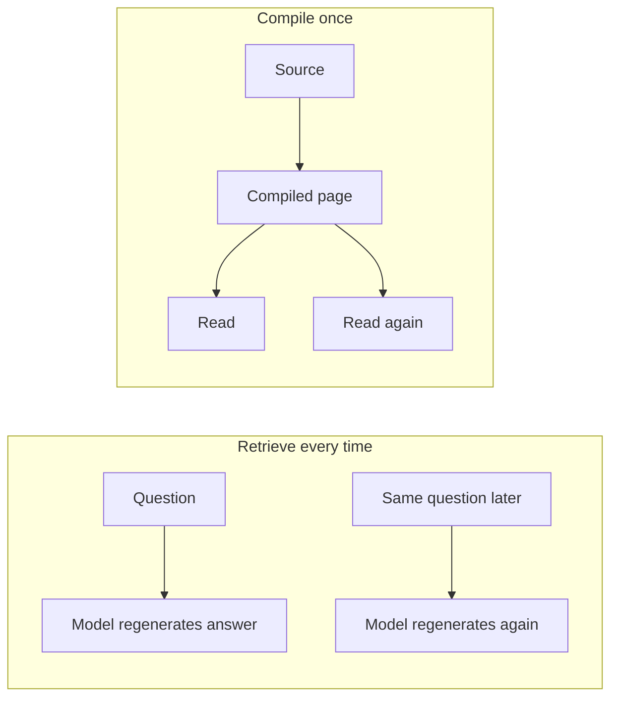
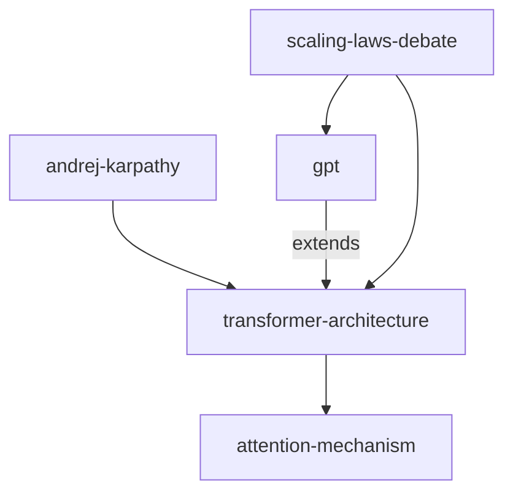

# Module 1.2: The LLM Wiki Pattern

> **Goal**: Understand Karpathy's "compile, don't retrieve" idea — why obsidian-wiki compiles knowledge once into linked pages instead of regenerating it on every query, and what that buys you.

---

## The Pattern's Origin

obsidian-wiki is built on Andrej Karpathy's "LLM Wiki" pattern, published as a public gist: <https://gist.github.com/karpathy/442a6bf555914893e9891c11519de94f>. The core insight is that a language model is best used to **distill** knowledge once, not to answer the same question over and over from scratch.



In the "retrieve every time" model, each question pays the full cost again and may get a slightly different answer. In the "compile once" model, the model does the hard work once, writes it down, and every later read is cheap and identical.

---

## Compile, Don't Retrieve

### The principle

"Compile, don't retrieve" is the first of obsidian-wiki's core operating principles. The wiki is treated as **pre-compiled knowledge**. When you ingest a source, the agent updates every relevant existing page — it does not just dump a fresh summary or regenerate an answer.

This is the same mental model as compiled code versus an interpreter. A compiler does the heavy analysis once and produces an artifact you can run many times. An interpreter re-does the work on every run. obsidian-wiki picks the compiler model for knowledge.

### What this looks like in practice

The framework states the rule plainly: **update existing pages — don't append or duplicate.**

```markdown
First ingest:   "React Server Components" article
                → creates concepts/react-server-components.md

Second ingest:  a different article on the same topic
                → MERGES new claims into the existing page
                → resolves any contradictions
                → strengthens cross-links

NOT:            a second page, or an appended blob of new text
```

Each ingest should make the wiki *smarter*, not just *bigger*. New information merges into what is already there. This is what the framework calls "compound over time" — the second core principle.

---

## What Compilation Buys You

Compiling knowledge once into stable pages gives you three concrete benefits.

### Speed

A compiled page is just markdown on disk. Reading it costs almost nothing compared to asking a model to regenerate the same content. The framework leans into this with cheap-to-expensive retrieval primitives — read the `index.md`, then a page's `summary:` field, and only open the full page body as a last resort.

| Need | Primitive | Relative cost |
|---|---|---|
| Does a page exist? | Read `index.md`, grep frontmatter | Cheapest |
| 1-2 sentence preview | Read the `summary:` field | Cheap |
| A specific claim | `Grep` the page with context lines | Medium |
| Whole-page content | `Read` the file | Expensive — last resort |

### Consistency

Because there is one page per topic, a question always resolves to the same compiled answer. There is no risk of two slightly different generations of "what is X" disagreeing. Provenance markers (`^[inferred]`, `^[ambiguous]`) keep the page honest about which claims are paraphrased from a source and which are synthesized — so the consistency is *trustworthy*, not just stable.

### A graph

This is the benefit unique to the wiki form. Pages connect to each other with `[[wikilinks]]`, so the compiled knowledge is not a folder of isolated files — it is a navigable graph.



Optional typed relationships (`extends`, `uses`, `contradicts`, and so on) add direction and meaning to the edges, so the graph can answer multi-hop questions like "how is X connected to Y" by walking the links — not by re-querying a model.

---

## Key Takeaways

1. **Karpathy's LLM Wiki** - obsidian-wiki implements the pattern from Andrej Karpathy's public gist, where a model distills knowledge once instead of answering from scratch each time.
2. **Compile, don't retrieve** - the wiki is pre-compiled knowledge; ingesting a source updates existing pages rather than regenerating answers.
3. **Compound over time** - new sources merge into existing pages, resolve contradictions, and strengthen links, so the wiki gets smarter, not just bigger.
4. **Compilation buys speed** - reading compiled markdown is far cheaper than regenerating content, and the framework escalates from cheap to expensive reads only when needed.
5. **Compilation buys consistency and a graph** - one page per topic gives stable answers, and `[[wikilinks]]` turn the pages into a navigable, multi-hop knowledge graph.

---

## Next Module Preview

In **Module 1.3: Three-Layer Architecture**, we'll explore:
- The Source layer — the raw inputs you want to remember
- The Wiki layer — compiled markdown pages with frontmatter and wikilinks in category folders
- The Maintenance loop — the skills that ingest, query, lint, and synthesize while keeping the state files current

See [Module 1.3: Three-Layer Architecture](1.3-three-layer-architecture.md).
