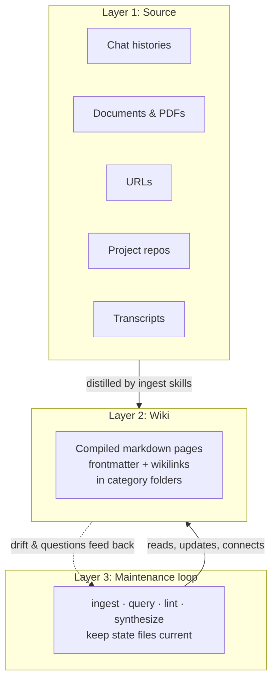
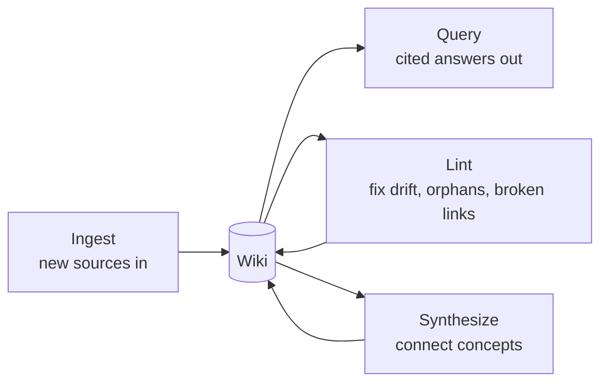

# Module 1.3: Three-Layer Architecture

> **Goal**: Understand the three layers obsidian-wiki operates on — Source, Wiki, and the Maintenance loop — and how raw inputs become compiled pages that stay current.

---

## The Three Layers

obsidian-wiki operates on three layers. Raw inputs flow into compiled pages, and a maintenance loop keeps those pages connected and fresh.



Think of it like building software: the Source layer is your source code (authoritative but hard to query directly), the Wiki layer is the compiled artifact, and the Maintenance loop is the build-and-test cycle that keeps the artifact in sync.

---

## Layer 1: Source

### Raw inputs, never modified

The Source layer is everything you want to remember, in its original form. The system never modifies these — they are immutable inputs. They live wherever you keep them (configured via `OBSIDIAN_SOURCES_DIR`).

| Source type | Example | Handled by |
|---|---|---|
| Chat / agent histories | `~/.claude`, `~/.codex`, `~/.hermes` sessions | per-agent history-ingest skills |
| Documents | PDFs, markdown, articles, papers | `wiki-ingest` |
| URLs | a web page you want to save | `ingest-url` / `wiki-ingest` |
| Project repos | the project you are working in | `wiki-update` |
| Transcripts & logs | meeting notes, exports, Slack threads | `data-ingest` |
| Images | screenshots, whiteboard photos, diagrams | ingest skills via vision |

Treat raw sources as "source code" — authoritative, but hard to query directly. That difficulty is exactly why the next layer exists.

---

## Layer 2: Wiki

### Compiled, interconnected pages

The Wiki layer is the compiled knowledge: a collection of Obsidian-compatible markdown pages, organized into category folders inside your vault. This is the artifact from [Module 1.1: What is obsidian-wiki](1.1-what-is-obsidian-wiki.md).

Every page has three things that make it part of a graph, not just a file:

- **Required frontmatter** — `title`, `category`, `tags`, `sources`, `created`, `updated`
- **`[[wikilinks]]`** — connecting it to related pages (or Markdown links when `OBSIDIAN_LINK_FORMAT=markdown`)
- **Clear provenance** — every claim traces back to a source

### Category folders

Pages are sorted into categories by what *kind* of knowledge they are:

```
$OBSIDIAN_VAULT_PATH/
├── concepts/      # ideas, theories, mental models
├── entities/      # people, orgs, tools, libraries
├── skills/        # how-to knowledge, procedures
├── references/    # summaries of specific sources
├── synthesis/     # cross-cutting analysis across sources
├── journal/       # timestamped observations, session logs
└── projects/      # per-project knowledge
```

A compiled page looks like this — frontmatter on top, linked prose below:

```markdown
---
title: Transformer Architecture
category: concepts
tags: [ml, architecture]
sources: [papers/attention.pdf]
summary: The dominant architecture for sequence modeling.
created: 2026-03-15T10:30:00Z
updated: 2026-03-15T10:30:00Z
---

# Transformer Architecture

Built on the [[attention-mechanism]], introduced by [[andrej-karpathy]]'s
former field. Transformers parallelize across positions, unlike RNNs.
This is why they scale better on modern hardware. ^[inferred]
```

---

## Layer 3: The Maintenance Loop

### Keeping the wiki alive

The Maintenance loop is the set of skills that act on the Wiki layer over time. Sources change, questions get asked, and pages drift — the loop handles all of it.



| Loop step | What it does | Example skills |
|---|---|---|
| Ingest | Distill new sources into pages | `wiki-ingest`, `claude-history-ingest`, `wiki-update` |
| Query | Answer questions with cited pages | `wiki-query`, `wiki-status` |
| Lint | Find orphans, broken links, stale content | `wiki-lint`, `cross-linker`, `tag-taxonomy` |
| Synthesize | Draw cross-cutting conclusions | `wiki-synthesize` |

### The four state files

Every write operation keeps four state files current. These are what let the next session pick up where the last one left off without re-scanning the whole vault.

| File | Purpose |
|---|---|
| `index.md` | Master catalog — every page listed by category with a one-line summary |
| `log.md` | Chronological, append-only record of every operation |
| `hot.md` | A ~500-word semantic snapshot of recent activity — keeps context warm |
| `.manifest.json` | Tracks every ingested source: path, timestamps, pages produced |

The manifest is what makes the loop efficient. On a repeat ingest, the agent checks the manifest to find only what changed (the delta) and processes just that — instead of re-ingesting everything. This is the "track everything" core principle in action.

---

## Key Takeaways

1. **Three layers** - Source (raw inputs) flows into the Wiki (compiled pages), and a Maintenance loop keeps the Wiki connected and current.
2. **Sources are immutable** - chat histories, documents, URLs, repos, and transcripts are treated like source code and never modified by the system.
3. **Pages are graph nodes** - every wiki page carries required frontmatter, `[[wikilinks]]`, and provenance, sorted into category folders like `concepts/` and `entities/`.
4. **The loop has four moves** - ingest, query, lint, and synthesize act on the Wiki layer over time.
5. **State files keep the loop efficient** - `index.md`, `log.md`, `hot.md`, and `.manifest.json` are updated on every write, and the manifest enables delta-only re-ingestion.

---

## Next Module Preview

In **Module 2.1: Skill Anatomy**, we'll explore:
- The structure of a single skill — the `SKILL.md` file at its core
- The optional supporting directories: `references/`, `scripts/`, `assets/`, `agents/`
- What each part is for and when a skill needs more than just instructions

See [Module 2.1: Skill Anatomy](../2-skill-system/2.1-skill-anatomy.md).
