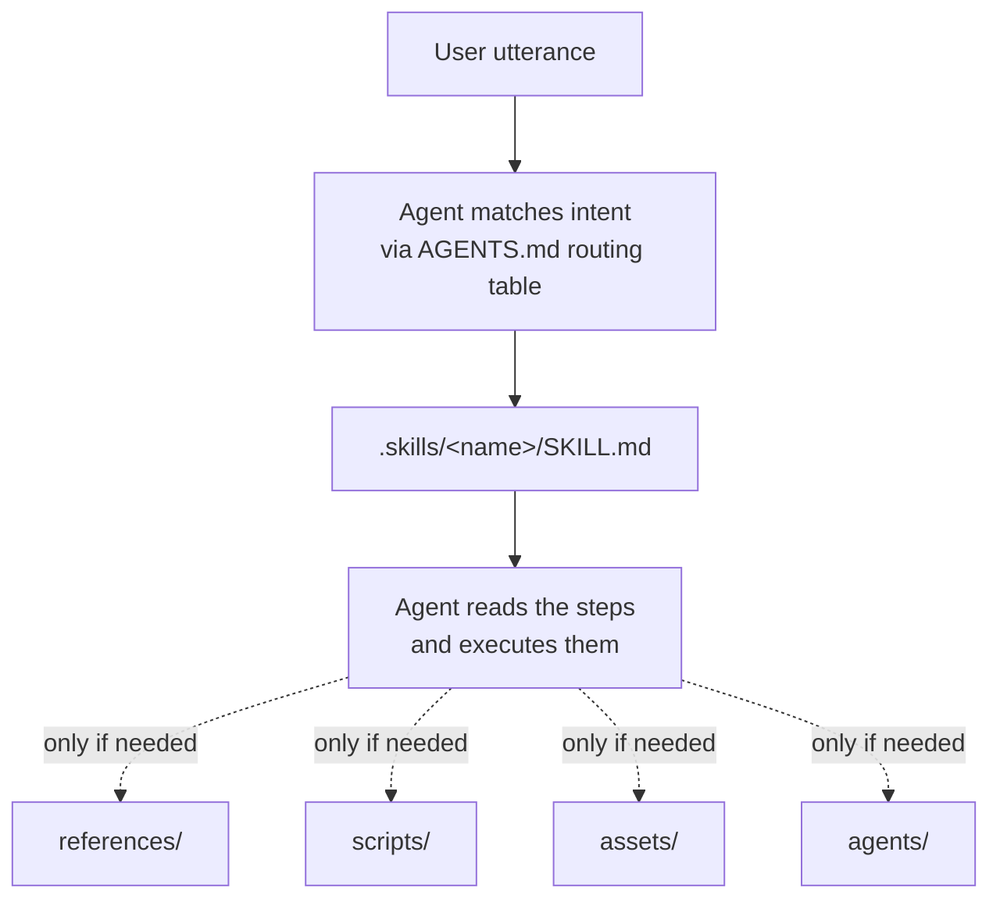

# Module 2.1: Skill Anatomy

> **Goal**: Learn the structure of a single skill — the one folder, the one required file, and the four optional parts that an agent loads only when it needs them.

---

## What a Skill Is

A skill is the core unit of obsidian-wiki. It is not code that runs — it is a folder of markdown instructions that an AI agent reads and then executes step by step. Every skill lives at `.skills/<name>/` and the only required file is `SKILL.md`. Everything else in the folder is optional context that the agent pulls in on demand.



This design keeps each skill cheap to load. The agent reads `SKILL.md` first. The other folders — `references/`, `scripts/`, `assets/`, `agents/` — are read only when the steps in `SKILL.md` tell the agent to open them. A simple skill is just one `SKILL.md`; a complex one adds the parts it needs.

---

## The Five Parts

### `SKILL.md` — the required file

Every skill has exactly one `SKILL.md`. It starts with a small YAML frontmatter block that holds the skill `name` and a long `description`. The `description` lists the trigger phrases the agent uses to decide when to run the skill. Below the frontmatter is the body: the actual instructions, written as numbered steps and prose for the agent to follow.

Here is the head of a real one, `.skills/wiki-ingest/SKILL.md`:

```yaml
---
name: wiki-ingest
description: >
  Ingest any source into the Obsidian wiki by distilling its knowledge
  into interconnected wiki pages. Handles structured documents (PDFs,
  markdown, articles, papers, notes, folders), raw/unstructured text ...
  Use whenever the user wants to add new sources to their wiki: "add this
  to the wiki", "process these docs", "ingest this folder" ...
---

# Obsidian Ingest — Document Distillation

You are ingesting source documents into an Obsidian wiki. Your job is
not to summarize — it is to **distill and integrate** knowledge ...
```

Notice the body addresses the agent directly ("You are ingesting…"). That is because the agent is the runtime — the markdown is the program.

### `references/` — on-demand context

This folder holds extra knowledge the skill needs only sometimes. The agent loads a reference file only when a step in `SKILL.md` points to it. `wiki-ingest` ships three:

```
.skills/wiki-ingest/references/
├── ingest-prompts.md
├── pageindex.md
└── url-sources.md
```

Keeping this detail out of `SKILL.md` keeps the main file short. A long reference document is read once, when the relevant step runs, instead of on every invocation.

### `scripts/` — helper scripts

Optional Bash or JS helpers the agent may invoke. Most skills have none — obsidian-wiki is instruction-based, so the agent usually does the work itself. `skill-creator` is one of the few skills that ships a `scripts/` folder.

### `assets/` — templates and fixtures

Templates, example pages, or test fixtures the skill copies or fills in. Again `skill-creator` carries an `assets/` folder, used when scaffolding a brand-new skill.

### `agents/` — sub-skill definitions

Definitions for sub-agents a skill can spawn for a focused subtask. `skill-creator` is the clearest example: it has an `agents/` folder for its helper agents.

---

## A Full Anatomy, Top to Bottom

Most skills are just `SKILL.md` plus maybe a `references/` folder. The largest skill in the repo, `skill-creator`, uses every optional part, so it shows the full shape:

```
.skills/skill-creator/
├── SKILL.md          # required — the instructions
├── references/       # on-demand context the steps point to
├── scripts/          # helper Bash/JS the agent may invoke
├── assets/           # templates, examples, fixtures
├── agents/           # sub-skill definitions
├── eval-viewer/      # evaluation artifacts (only skill-creator)
└── LICENSE.txt
```

Compare that to a minimal skill like `daily-update`, which is a single file:

```
.skills/daily-update/
└── SKILL.md
```

Both are valid skills. The folder grows only as a skill needs more than instructions.

---

## Naming Conventions

Skill folder names tell you what a skill does at a glance. Three patterns run through the 30-plus skills in `.skills/`:

| Pattern | Meaning | Examples |
|---|---|---|
| `wiki-*` | A core wiki operation | `wiki-ingest`, `wiki-query`, `wiki-lint`, `wiki-status`, `wiki-update` |
| `*-history-ingest` | Pulls in one AI tool's past sessions | `claude-history-ingest`, `codex-history-ingest`, `hermes-history-ingest`, `openclaw-history-ingest`, `copilot-history-ingest` |
| `*-ingest` (general) | Brings a source into the vault | `wiki-ingest`, `wiki-history-ingest` (the router) |

A few skills sit outside these patterns because they are not wiki-scoped operations — for example `llm-wiki` (the theory skill), `cross-linker`, `tag-taxonomy`, `graph-colorize`, `memory-bridge`, `impl-validator`, and `skill-creator`.

---

## Key Takeaways

1. **One folder, one required file** - A skill is `.skills/<name>/` and must contain a `SKILL.md`; everything else is optional.
2. **The agent is the runtime** - `SKILL.md` is markdown instructions written to the agent, not code that executes on its own.
3. **Frontmatter drives triggering** - The `name` and `description` (with its trigger phrases) in the YAML header are how the agent decides when to run the skill.
4. **Optional parts load on demand** - `references/`, `scripts/`, `assets/`, and `agents/` are read only when a step in `SKILL.md` points to them, keeping the main file short.
5. **Names signal purpose** - `wiki-*` are core operations, `*-history-ingest` pull one tool's past sessions, and `*-ingest` bring sources in.

---

## Next Module Preview
In **Module 2.2: Skill Routing & Discovery**, you will see how a plain user sentence becomes the right `SKILL.md`:
- How the `AGENTS.md` routing table maps trigger phrases to skill names
- How each agent finds skills in its own `*/skills/` discovery directory
- The full match-read-execute path the host agent walks every time

See also the previous phase, [Module 1.3: Three-Layer Architecture](../1-foundations/1.3-three-layer-architecture.md), for where skills sit in the larger system.
