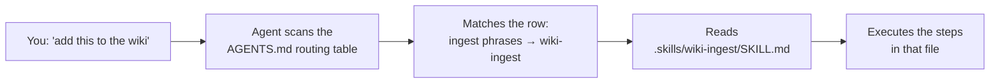
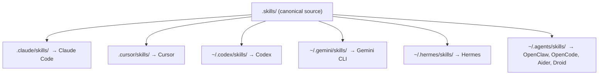

# Module 2.2: Skill Routing & Discovery

> **Goal**: Follow a plain user sentence as it turns into the right `SKILL.md` — through the `AGENTS.md` routing table and the agent's own skill discovery directory.

---

## The Routing Table

obsidian-wiki has no parser and no command dispatcher. Instead, the routing logic lives in a markdown table inside `AGENTS.md`. When you say something to the agent, the agent reads that table, finds the row whose trigger phrases best match what you said, and runs the named skill.

The table is intentionally fuzzy. Each row lists several ways a user might phrase the same intent, separated by slashes. The agent does not need an exact match — it picks the closest row. This is why "ingest", "add this to the wiki", and "process these docs" all land on the same skill.

---

## Reading the Table

### Real rows from `AGENTS.md`

Here are a few rows copied from the routing table in `AGENTS.md`. The left column is what you might say; the right column is the skill the agent runs:

| User says something like… | Skill |
|---|---|
| "set up my wiki" / "initialize" | `wiki-setup` |
| "ingest" / "add this to the wiki" / "process these docs" / "/ingest-url <url>" | `wiki-ingest` |
| "import my Claude history" / "mine my conversations" | `claude-history-ingest` |
| "import my Hermes history" / "mine my Hermes memories" / "ingest ~/.hermes" | `hermes-history-ingest` |
| "what's the status" / "what's been ingested" / "show the delta" | `wiki-status` |
| "what do I know about X" / "find info on Y" / any question | `wiki-query` |
| "audit" / "lint" / "find broken links" / "wiki health" | `wiki-lint` |
| "update wiki" / "sync to wiki" / "save this to my wiki" | `wiki-update` |

Two things to notice. First, slash commands (like `/ingest-url` or `/daily-update`) are just more trigger phrases in the same column — they are not a separate system. Second, some rows route to a *mode* of a skill, not only a skill: "wiki insights" / "hubs" / "wiki structure" routes to `wiki-status` in its insights mode. The agent reads the parenthetical hint and runs the skill accordingly.

### When two rows look close

If your sentence could match more than one row, the agent uses the more specific match. For example "import my Claude history" matches the dedicated `claude-history-ingest` row rather than the general `wiki-ingest` row, because the phrasing is closer. General catch-all skills like `wiki-ingest` exist precisely for sources that no more specific row covers.

---

## How an Agent Discovers Skills

The routing table tells the agent *which* skill to run. But the agent also has to be able to *find* the skill's folder on disk. Each agent looks in its own discovery directory — a `*/skills/` folder it scans at startup.

Each of those discovery folders is filled with symlinks that point back to the one canonical `.skills/` directory. So every agent reads the same skill definitions — Cursor's `.cursor/skills/wiki-ingest` and Codex's `~/.codex/skills/wiki-ingest` both resolve to `.skills/wiki-ingest/`. You write a skill once and every agent can run it.

The full list of discovery paths (project-local and global) is set up by `setup.sh`. Module 2.3 covers that fan-out in detail.

---

## The Match-Read-Execute Path

Put together, every request walks the same three steps:

1. **Match** — The agent reads the `AGENTS.md` routing table and picks the row whose trigger phrases match your utterance, giving it a skill name.
2. **Read** — The agent finds that skill in its discovery directory (e.g. `~/.codex/skills/<name>/`, a symlink to `.skills/<name>/`) and reads `SKILL.md`.
3. **Execute** — The agent follows the numbered steps in `SKILL.md`, loading `references/` or other optional parts only when a step points to them.

Because `AGENTS.md` is also the "always-on" project context that the agent loads at the start of a session, the routing table is in front of the agent before you say anything. There is no lookup cost at request time beyond reading what is already loaded.

---

## Key Takeaways

1. **Routing is a markdown table** - `AGENTS.md` holds a table mapping trigger phrases to skill names; there is no parser or dispatcher.
2. **Matching is fuzzy and intent-based** - Many phrasings per row, slash commands included, and the agent picks the closest match rather than requiring an exact one.
3. **Specific beats general** - A dedicated row like `claude-history-ingest` wins over the catch-all `wiki-ingest` when the phrasing is closer.
4. **Each agent discovers skills in its own folder** - Agents scan a `*/skills/` directory that is filled with symlinks back to the single `.skills/` source.
5. **Every request is match → read → execute** - Find the skill name in the table, read its `SKILL.md` from the discovery dir, then run the steps.

---

## Next Module Preview
In **Module 2.3: Canonical Source & Multi-Agent Fan-Out**, you will see why all those discovery folders point to the same place:
- The single canonical `.skills/` source symlinked into 10-plus agent paths
- The agent matrix — Claude Code, Cursor, Windsurf, Codex, Gemini, Hermes, OpenClaw, Kiro, Copilot, and more
- The single-source-of-truth design: `AGENTS.md` is canonical and `CLAUDE.md`, `GEMINI.md`, `.hermes.md` are symlinks to it
- The special Hermes case and why `setup.sh` recreates it on every run
