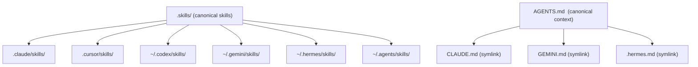

# Module 2.3: Canonical Source & Multi-Agent Fan-Out

> **Goal**: Understand how one canonical `.skills/` source and one canonical `AGENTS.md` reach a dozen different AI agents through symlinks — written once, run everywhere.

---

## One Source, Many Agents

Every supported AI agent — Claude Code, Cursor, Codex, and the rest — has its own idea of where skills live and where it reads project context. obsidian-wiki does not maintain a separate copy of each skill for each agent. Instead it keeps **one** canonical `.skills/` directory and **one** canonical `AGENTS.md`, then symlinks them into every place each agent looks.



This is the single-source-of-truth design. Edit a skill in `.skills/` and every agent sees the change, because each agent's discovery folder only holds symlinks back to that one folder. Edit `AGENTS.md` and Claude Code, Gemini, and Hermes all see it too, because their context files are symlinks to it.

---

## The Agent Matrix

`setup.sh` fans the skills out into a discovery directory for each agent, and pairs each agent with an "always-on" context file. The table below is the full set, drawn from the architecture doc and the directories `setup.sh` writes:

| Agent | Always-on context file | Skill discovery directory |
|---|---|---|
| Claude Code | `CLAUDE.md` (symlink → `AGENTS.md`) | `.claude/skills/` + `~/.claude/skills/` |
| Cursor | `.cursor/rules/obsidian-wiki.mdc` | `.cursor/skills/` |
| Windsurf | `.windsurf/rules/obsidian-wiki.md` | `.windsurf/skills/` |
| Codex | `AGENTS.md` | `~/.codex/skills/` |
| Gemini CLI | `GEMINI.md` (symlink → `AGENTS.md`) | `~/.gemini/skills/` |
| Antigravity | `.agent/rules/` + `.agent/workflows/` | `~/.gemini/antigravity/skills/` |
| Kiro | `.kiro/steering/obsidian-wiki.md` | `.kiro/skills/` + `~/.kiro/skills/` |
| Hermes | `.hermes.md` (symlink → `AGENTS.md`) | `~/.hermes/skills/` |
| OpenClaw | `AGENTS.md` | `~/.openclaw/skills/` + `~/.agents/skills/` |
| OpenCode / Aider / Factory Droid | `AGENTS.md` | `~/.agents/skills/` |
| Trae / Trae CN | `AGENTS.md` | `~/.trae/skills/` + `~/.trae-cn/skills/` |
| GitHub Copilot | `.github/copilot-instructions.md` | `~/.copilot/skills/` |

Two notes on the discovery directories. First, `~/.agents/skills/` is a shared catch-all: any AGENTS.md-aware agent (OpenClaw, OpenCode, Aider, Factory Droid) finds skills there. Second, `~/.claude/skills/` is special — `setup.sh` installs only the two portable skills (`wiki-update` and `wiki-query`) there, so they work from any project without flooding Claude Code's global skill list with the full 30-plus set.

---

## The `AGENTS.md` Symlinks

Different agents read different filenames for their project context. Claude Code reads `CLAUDE.md`, Gemini reads `GEMINI.md`, Hermes reads `.hermes.md`, and Codex/OpenClaw/others read `AGENTS.md` directly. obsidian-wiki treats `AGENTS.md` as canonical and makes the others symlinks to it.

You can see this in the repo itself:

```
CLAUDE.md   → AGENTS.md
GEMINI.md   → AGENTS.md
.hermes.md  → AGENTS.md
```

So there is exactly one routing table, one vault layout, one set of core principles — written once in `AGENTS.md`. The per-agent filenames are just aliases. Change a routing row in `AGENTS.md` and every agent that reads one of these aliases gets the change with no extra step.

---

## The Hermes Case

Hermes needs two things, and `setup.sh` handles both.

### The `.hermes.md` symlink

Hermes resolves `.hermes.md` before it would fall back to `AGENTS.md`. To keep a single source of truth, `setup.sh` creates `.hermes.md` as a symlink to `AGENTS.md`. The installer is defensive about it: if `.hermes.md` is already a symlink it removes it first; if it is a stray regular file (which can happen when Git on Windows materializes a committed symlink as a plain text file) it replaces it. Then it recreates the symlink:

```bash
# from setup.sh
ln -s AGENTS.md "$HERMES_BOOTSTRAP"
```

### The `~/.hermes/skills/` fan-out

Hermes also needs the skills themselves. `setup.sh` symlinks the canonical `.skills/` into `~/.hermes/skills/` (the default Hermes home). It goes further for power users: if `$HERMES_HOME` points to a non-default location, that path gets a skills tree too, and every named profile under `~/.hermes/profiles/*/` gets its own `skills/` symlink tree. So a multi-profile Hermes install still finds the same skills everywhere.

Because all of this is symlink creation, `setup.sh` recreates it on **every run**. Re-running the installer is safe and idempotent — it removes stale symlinks, skips real directories so it never clobbers your own files, and rebuilds the links. If a symlink ever breaks or you add a profile, you just run `bash setup.sh` again.

---

## Key Takeaways

1. **One canonical source each** - `.skills/` holds the only copy of every skill, and `AGENTS.md` holds the only copy of the routing table and context.
2. **Discovery folders are symlinks** - Each agent's `*/skills/` directory is filled with symlinks back to `.skills/`, so every agent runs the same definitions.
3. **Context filenames are aliases** - `CLAUDE.md`, `GEMINI.md`, and `.hermes.md` are symlinks to `AGENTS.md`; there is one source of truth, many names.
4. **Hermes needs two links** - `.hermes.md → AGENTS.md` for context, plus `~/.hermes/skills/` (and every named profile) for skill discovery.
5. **`setup.sh` is idempotent** - It recreates all symlinks on every run, removing stale links and skipping real directories so it never destroys your data.

---

## Next Module Preview
In **Module 3.1: The Installer (setup.sh)**, you will walk the installer end to end:
- Each step `setup.sh` runs — `.env` creation, global config, the symlink fan-out, and the bootstrap aliases
- The `.hermes.md` workaround in its full installer context
- How `install_skills()` avoids clobbering your data (stale-link removal, real-directory skips, the Git-on-Windows fix)

Continue to [Module 3.1: The Installer](../3-setup-config/3.1-the-installer.md).
