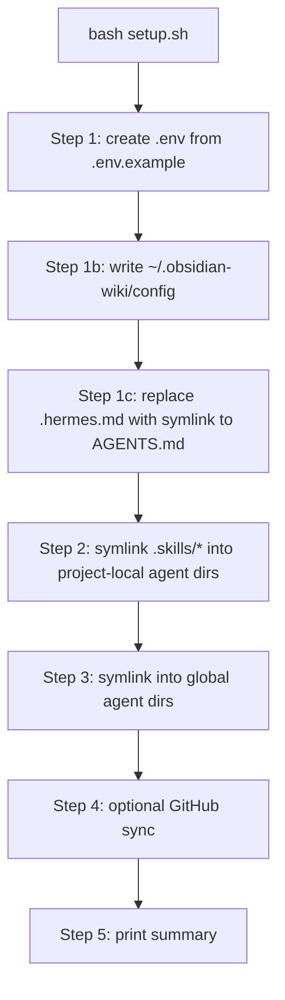

# Module 3.1: The Installer (setup.sh)

> **Goal**: Understand exactly what `setup.sh` does, step by step, so you know what changes on your machine when you install obsidian-wiki.

---

## What the Installer Is For
obsidian-wiki has no runtime. The whole job of `setup.sh` is to make the one canonical `.skills/` directory *discoverable* to every AI agent you use, and to write a small config file so the portable skills work from any folder. It is a Bash script that uses only standard Unix tools (`ln`, `sed`, `mkdir`) — no Node, Python, or Go.

You run it once after cloning:

```bash
git clone https://github.com/Ar9av/obsidian-wiki.git
cd obsidian-wiki
bash setup.sh
```



Each step is small and idempotent — running `setup.sh` again is safe and is in fact the recommended fix when a symlink goes stale.

---

## Step 1: Create .env
If no `.env` exists in the repo, the installer copies `.env.example` to `.env` and tells you to set `OBSIDIAN_VAULT_PATH`. If `.env` already exists, it leaves it alone.

```bash
cp .env.example .env   # only when .env is missing
```

This is where all your config lives. Module 3.3 covers every variable.

---

## Step 1b: Prompt for the Vault Path and Write Global Config
The installer reads `OBSIDIAN_VAULT_PATH` out of `.env`. If that value is empty or still the placeholder `/path/to/your/vault`, it asks you:

```
Where is your Obsidian vault? (absolute path):
```

Whatever you type is written back into `.env` (quoted, so paths with spaces survive). Then it writes a global config file at `~/.obsidian-wiki/config`:

```bash
OBSIDIAN_VAULT_PATH="/Users/you/MyVault"
OBSIDIAN_WIKI_REPO="/Users/you/obsidian-wiki"
```

This global file is what lets the two portable skills (`wiki-update`, `wiki-query`) find your vault when you run them from some *other* project. You will see how skills read it in Module 3.2.

---

## Step 1c: The .hermes.md Symlink (Windows Workaround)
Hermes looks for `.hermes.md` before `AGENTS.md`. To keep one source of truth, the installer makes `.hermes.md` a symlink pointing at `AGENTS.md`.

The handling is careful:

```bash
if [ -L "$HERMES_BOOTSTRAP" ]; then
  rm "$HERMES_BOOTSTRAP"          # already a symlink → remove and re-create fresh
elif [ -f "$HERMES_BOOTSTRAP" ]; then
  rm "$HERMES_BOOTSTRAP"          # a real file → replace it
fi
ln -s AGENTS.md "$HERMES_BOOTSTRAP"
```

Why replace a regular file? On Windows, Git without `core.symlinks=true` checks out committed symlinks as **plain text files containing the target path**. So a freshly cloned `.hermes.md` may be a file holding the text `AGENTS.md` instead of a real link. The installer detects this and rewrites it as a true symlink on every run. (`CLAUDE.md` and `GEMINI.md` follow the same single-source pattern — see Module 2.3 at [../2-skill-system/2.3-canonical-source-and-fanout.md](../2-skill-system/2.3-canonical-source-and-fanout.md).)

---

## Step 2: Symlink Skills into Project-Local Dirs
Now the fan-out. The installer links every directory in `.skills/*` into each agent's project-local discovery folder:

```
.claude/skills/     → Claude Code
.cursor/skills/     → Cursor
.windsurf/skills/   → Windsurf
.agents/skills/     → AGENTS.md-aware agents (generic)
.pi/skills/         → Pi coding agent
.kiro/skills/       → Kiro IDE/CLI
```

These use **relative** symlinks (`../../.skills/<name>`) so they keep working if you move the whole repo.

---

## Step 3: Symlink into Global Dirs
The installer also links skills into each agent's *global* skill directory, so the skills are available no matter which project you open:

```
~/.claude/skills/    → ONLY wiki-update + wiki-query
~/.gemini/skills/    → all skills
~/.codex/skills/     → all skills
~/.hermes/skills/    → all skills (plus any named Hermes profiles)
~/.openclaw/skills/  → all skills
~/.copilot/skills/   → all skills
~/.trae/skills/, ~/.trae-cn/skills/, ~/.kiro/skills/, ~/.pi/agent/skills/, ~/.agents/skills/
```

Note the one exception: **`~/.claude/skills/` gets only the two portable skills**, `wiki-update` and `wiki-query`. This keeps Claude Code's global skill list small instead of polluting it with the full set. The repo-local `.claude/skills/` still gets everything.

```bash
# all skills:
install_skills "$HOME/.codex/skills" "~/.codex/skills/"
# subset only:
install_skills "$HOME/.claude/skills" "..." absolute wiki-update wiki-query
```

---

## How install_skills() Avoids Data Loss
All the linking goes through one function, `install_skills()`. For every skill it decides what to do based on what already sits at the target path:

| What's at the link path | Action |
|---|---|
| An existing symlink | `rm` it, then create a fresh link (clears stale links) |
| A **real directory** | Skip with a warning, never delete (protects your own files) |
| A regular file | `rm` it (the Windows symlink-as-file case) and re-link |

```bash
if [ -L "$link_path" ]; then
  rm "$link_path"
elif [ -d "$link_path" ]; then
  echo "⚠️  $link_path is a real directory, skipping symlink"
  continue
elif [ -f "$link_path" ]; then
  rm "$link_path"
fi
ln -s "$link_target" "$link_path"
```

The directory case is the important safety rule: if you ever put your own real folder where a skill link would go, the installer leaves it untouched and warns you. After each link it also checks that `SKILL.md` resolves through the new symlink — a broken link aborts the run instead of silently shipping a dead skill.

---

## Alternative: npx skills add
You do not have to clone and run `setup.sh` by hand. The preferred install path uses the `skills` CLI:

```bash
npx skills add Ar9av/obsidian-wiki
```

This handles the per-agent install for you. Both paths end up doing the same thing — symlinking the same `.skills/` into your agents' discovery directories.

---

## Key Takeaways
1. **One installer, one job** - `setup.sh` makes `.skills/` discoverable to many agents and writes the global config; it installs no runtime.
2. **Global config is the portability key** - `~/.obsidian-wiki/config` (written in Step 1b) holds `OBSIDIAN_VAULT_PATH` so `wiki-update` and `wiki-query` work from any directory.
3. **.hermes.md is a symlink with a Windows fix** - the installer rewrites it as a real link every run, replacing the plain-text file Git-on-Windows leaves behind.
4. **Claude Code's global dir is special** - only `wiki-update` and `wiki-query` are linked into `~/.claude/skills/`; every other agent gets all skills.
5. **install_skills() never clobbers real dirs** - it clears stale symlinks and replaces Windows file-artifacts, but skips real directories with a warning, so your own data is safe.

---

## Next Module Preview
In **Module 3.2: Config Resolution Protocol**, you will follow how a skill actually *finds* your vault at runtime:
- The walk-up search for a `.env` containing `OBSIDIAN_VAULT_PATH`, starting at the current directory and climbing to `$HOME`
- The fallback to `~/.obsidian-wiki/config` when no local `.env` is found
- The `wiki-setup` prompt when neither exists
- Reading the vault-side `AGENTS.md` for owner-specific overrides after config is resolved
