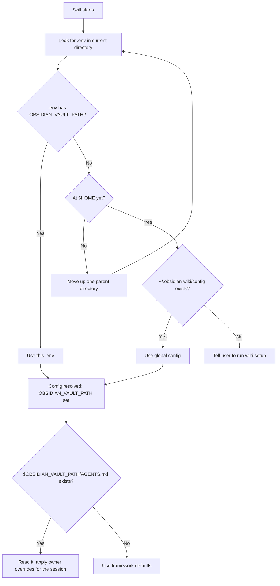

# Module 3.2: Config Resolution Protocol

> **Goal**: Understand how any skill, from any directory, figures out where your vault lives and which owner-specific rules to apply.

---

## Why a Protocol Is Needed
A skill can run from inside the obsidian-wiki repo, or from a totally different project you happen to be working in. So a skill can never assume the config sits "right here". Instead it follows a fixed search — the **Config Resolution Protocol**, documented in `.skills/llm-wiki/SKILL.md` and repeated in `AGENTS.md`. The goal of the protocol is to produce one value above all: `OBSIDIAN_VAULT_PATH`.



---

## Step 1: Walk Up From the Current Directory
The skill starts in your current working directory and looks for a `.env` file. The match is specific: the `.env` must **contain `OBSIDIAN_VAULT_PATH`**. A `.env` that exists but has no vault path does not count.

If the current directory has no qualifying `.env`, the skill moves up to the parent directory and checks again. It keeps climbing — one parent at a time — and **stops at the first `.env` that matches**, or stops climbing once it reaches `$HOME`.

### Why walk up instead of one fixed location?
This lets a project keep its own `.env` (for example, a work repo that points at a separate work vault) and have skills pick it up automatically when you run them from inside that project. The nearest matching `.env` wins, so a project-local config overrides the global one.

```
/Users/you/work/repo/subdir   ← you run a skill here
/Users/you/work/repo/.env     ← found: has OBSIDIAN_VAULT_PATH → use this
/Users/you/work/.env          ← never reached
~/.obsidian-wiki/config       ← never reached
```

---

## Step 2: Fall Back to the Global Config
If the walk-up reaches `$HOME` without finding any `.env` that contains `OBSIDIAN_VAULT_PATH`, the skill reads the global config file:

```
~/.obsidian-wiki/config
```

This is the file `setup.sh` wrote during install (Module 3.1, Step 1b). It holds at least `OBSIDIAN_VAULT_PATH` and usually `OBSIDIAN_WIKI_REPO`. This fallback is what makes the portable skills — `wiki-update` and `wiki-query` — work from *any* directory, even one with no `.env` at all.

---

## Step 3: Prompt for Setup
If there is no qualifying `.env` **and** no `~/.obsidian-wiki/config`, the skill has nothing to point at. It does not guess. It tells you to run `wiki-setup` (or `bash setup.sh`) to create the config first.

This is the "you haven't installed yet" path — you will only see it on a fresh machine.

---

## Step 4: Read the Vault-Side AGENTS.md
Resolving the config is only half the job. **After** the config is resolved, the skill always checks for a file at:

```
$OBSIDIAN_VAULT_PATH/AGENTS.md
```

If it exists, the skill reads it and applies it for the rest of the session. This file holds **owner-specific overrides** — things like:

- Domain vocabulary (your own terms and how to tag them)
- Ingest preferences (what to keep, what to skip)
- Writing style for pages
- Project scoping rules

These overrides take priority over the framework's built-in defaults. Note this is a *different* `AGENTS.md` from the one in the repo: the repo's `AGENTS.md` is the framework's routing and principles; the vault's `AGENTS.md` is *your* personal tuning of how the framework behaves on your knowledge.

```bash
# After config resolution, always:
cat "$OBSIDIAN_VAULT_PATH/AGENTS.md"   # if present → owner rules win this session
```

---

## Putting It Together
The whole protocol is "find the nearest config, then layer your personal rules on top":

| Phase | Source | What it provides |
|---|---|---|
| Resolve | Nearest `.env` with `OBSIDIAN_VAULT_PATH` (walk up to `$HOME`) | Vault path + project-local settings |
| Resolve (fallback) | `~/.obsidian-wiki/config` | Vault path for portable skills, any directory |
| Resolve (none) | — | Prompt to run `wiki-setup` |
| Override | `$OBSIDIAN_VAULT_PATH/AGENTS.md` | Owner-specific rules for the session |

---

## Key Takeaways
1. **The protocol exists to find one value** - `OBSIDIAN_VAULT_PATH` — so a skill works the same from inside the repo or from any other project.
2. **Walk-up, nearest-wins** - the search climbs from the current directory to `$HOME` and stops at the first `.env` that *contains* `OBSIDIAN_VAULT_PATH`, letting project-local config override global.
3. **Global config is the fallback** - `~/.obsidian-wiki/config` is read only when no qualifying `.env` is found; it powers the portable skills from any directory.
4. **No config means no guessing** - if neither source exists, the skill stops and tells you to run `wiki-setup`.
5. **Vault AGENTS.md is layered on after resolution** - it carries owner overrides (vocabulary, ingest, style) that beat framework defaults for the whole session.

---

## Next Module Preview
In **Module 3.3: Environment Variables**, you will get the full `.env` reference:
- Which variable is required (`OBSIDIAN_VAULT_PATH`) and which are optional
- The exact defaults, verified against `.env.example`
- What each variable controls — sources, categories, ingest caps, history paths, link format, and the QMD collection names
