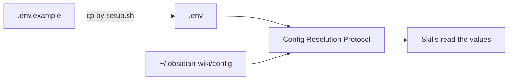

# Module 3.3: Environment Variables

> **Goal**: Know every variable in `.env`, whether it is required, what it defaults to, and what it controls.

---

## Where These Live
All settings live in the repo's `.env` (created from `.env.example` by the installer) and, for the portable case, in `~/.obsidian-wiki/config`. The Config Resolution Protocol from Module 3.2 reads one of these and exposes the values to every skill. Only one variable is truly required — the rest tune behavior and have safe defaults.



---

## The Full Reference

### Required
The one value the whole system cannot run without:

| Variable | Required | Default | Purpose |
|---|---|---|---|
| `OBSIDIAN_VAULT_PATH` | Yes | — | Absolute path to your Obsidian vault directory. Everything is written here. |

### Core Optional Settings

| Variable | Required | Default | Purpose |
|---|---|---|---|
| `OBSIDIAN_SOURCES_DIR` | No | *(empty)* | Comma-separated source directories to ingest documents from. Empty means skip document ingestion. |
| `OBSIDIAN_CATEGORIES` | No | `concepts,entities,skills,references,synthesis,journal` | The category folders created inside the vault. |
| `OBSIDIAN_MAX_PAGES_PER_INGEST` | No | `15` | Cap on how many pages a single ingest run may create or update. |
| `OBSIDIAN_LINK_FORMAT` | No | `wikilink` | Internal link style for new writes: `wikilink` (`[[concepts/foo]]`) or `markdown` (`[text](relative/path.md)`). Affects future writes only — existing content is never migrated. |
| `OBSIDIAN_RAW_DIR` | No | `_raw` | Staging directory inside the vault for unprocessed drafts. `wiki-ingest` promotes these and deletes them after. |
| `LINT_SCHEDULE` | No | `weekly` | How often lint runs: `daily`, `weekly`, or `manual`. |

### History Ingest Paths

| Variable | Required | Default | Purpose |
|---|---|---|---|
| `CLAUDE_HISTORY_PATH` | No | auto-discover from `~/.claude` | Override the Claude conversation history root. |
| `CODEX_HISTORY_PATH` | No | `~/.codex` | Override the Codex history root. |

> Note: `.env.example` also ships `PI_HISTORY_PATH` (default `~/.pi/agent/sessions`) and `WIKI_SKIP_PROJECTS` (default empty — comma-separated substrings of project dir names to skip during history ingest). These follow the same override pattern.

### QMD Semantic Search (optional)
QMD is an external tool that indexes your wiki and sources for fast semantic search. Without it, `wiki-ingest` and `wiki-query` fall back to Grep/Glob — fully functional, just slower.

| Variable | Required | Default | Purpose |
|---|---|---|---|
| `QMD_WIKI_COLLECTION` | No | *(empty)* | QMD collection name indexing your compiled wiki pages (the vault). |
| `QMD_PAPERS_COLLECTION` | No | *(empty)* | QMD collection name indexing your raw source documents. |

---

## A Minimal .env
The smallest working config is a single line:

```bash
OBSIDIAN_VAULT_PATH="/Users/you/MyVault"
```

Everything else inherits its default. The installer fills this line in for you during Step 1b (Module 3.1).

## A Typical Tuned .env
A more complete setup that ingests from a docs folder, uses Markdown links, and turns on weekly lint:

```bash
OBSIDIAN_VAULT_PATH="/Users/you/MyVault"
OBSIDIAN_SOURCES_DIR="/Users/you/Documents/notes,/Users/you/papers"
OBSIDIAN_CATEGORIES="concepts,entities,skills,references,synthesis,journal"
OBSIDIAN_MAX_PAGES_PER_INGEST=15
OBSIDIAN_LINK_FORMAT=markdown
OBSIDIAN_RAW_DIR=_raw
LINT_SCHEDULE=weekly
```

---

## Notes on Two Tricky Ones

### OBSIDIAN_LINK_FORMAT
This only affects pages written *after* you change it. Switching from `wikilink` to `markdown` does **not** rewrite existing pages — the vault is never migrated automatically. Pick the style early if you can.

### OBSIDIAN_MAX_PAGES_PER_INGEST
The default of `15` is a guardrail. A large source could otherwise generate a flood of pages in one run. Raise it if you trust a big ingest; lower it to force small, reviewable batches.

---

## Key Takeaways
1. **Only one variable is required** - `OBSIDIAN_VAULT_PATH`; everything else has a working default.
2. **Categories and link format shape the vault** - `OBSIDIAN_CATEGORIES` defines the folders; `OBSIDIAN_LINK_FORMAT` picks `[[wikilink]]` vs Markdown link style.
3. **Link format is forward-only** - changing `OBSIDIAN_LINK_FORMAT` affects new writes; it never migrates existing pages.
4. **History paths are overrides, not requirements** - `CLAUDE_HISTORY_PATH` auto-discovers from `~/.claude` and `CODEX_HISTORY_PATH` defaults to `~/.codex`; set them only to point elsewhere.
5. **QMD is optional acceleration** - the `QMD_*` collection names enable semantic search; leave them empty and skills fall back to Grep/Glob.

---

## Next Module Preview
In **Module 4.1: Vault Structure & Categories** ([../4-knowledge-vault/4.1-vault-structure.md](../4-knowledge-vault/4.1-vault-structure.md)), you move from configuration to the data model itself:
- The folder layout the system maintains (`concepts/`, `entities/`, `skills/`, `references/`, `synthesis/`, `journal/`, `projects/`)
- How a piece of knowledge is sorted into the right category
- The special files at the vault root and what each one tracks
