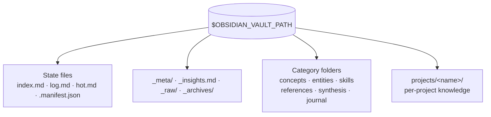

# Module 4.1: Vault Structure & Categories

> **Goal**: Learn the folder layout of the compiled vault and which kind of page goes in each folder.

---

## The Vault Is the Output
In [Module 3.3](../3-setup-config/3.3-environment-variables.md) you saw how config points the framework at `OBSIDIAN_VAULT_PATH`. That path is the vault — the single store the whole system maintains. Everything the skills produce lands here as plain markdown files, sorted into a fixed set of folders.



The folders split into two ideas: **category folders** say *what kind* of knowledge a page holds, and the **projects/** tree says *where* the knowledge came from. State files and the `_`-prefixed helpers sit at the root and hold metadata, not content pages.

---

## The Full Layout
Here is the complete vault tree as it appears in the data model. Read each comment — it tells you what belongs in that folder.

```
$OBSIDIAN_VAULT_PATH/
├── index.md              # master catalog — every page, always current
├── log.md                # chronological op log (ingests, updates, lints)
├── hot.md                # ~500-word semantic snapshot of recent activity
├── .manifest.json        # ingest ledger (paths, timestamps, pages produced, last_commit_synced)
├── _meta/
│   ├── taxonomy.md       # controlled tag vocabulary
│   └── *.base            # Obsidian Bases dashboard definitions
├── _insights.md          # graph analysis (hubs, bridges, dead ends)
├── _raw/                 # staging area for unprocessed drafts
├── _archives/            # full snapshots from wiki-rebuild
├── concepts/             # abstract ideas, patterns, mental models
├── entities/             # people, tools, libraries, companies
├── skills/               # how-to knowledge, techniques, procedures
├── references/           # factual lookups — specs, APIs, configs
├── synthesis/            # cross-cutting analysis
├── journal/              # time-bound entries
└── projects/<name>/      # per-project knowledge (optional sub-tree)
```

The four files at the top — `index.md`, `log.md`, `hot.md`, `.manifest.json` — are the state files. Module 4.3 covers them in detail. The `_`-prefixed items are framework metadata, not knowledge pages.

---

## What Goes in Each Category Folder
### The six content categories
Every knowledge page lands in one category folder. The category answers "what kind of thing is this?"

| Folder | What it holds | Example |
|---|---|---|
| `concepts/` | Abstract ideas, theories, patterns, mental models | `concepts/transformer-architecture.md` |
| `entities/` | Concrete things — people, orgs, tools, libraries, companies | `entities/andrej-karpathy.md` |
| `skills/` | How-to knowledge, techniques, procedures | `skills/fine-tuning-llms.md` |
| `references/` | Factual lookups — specs, APIs, configs, source summaries | `references/attention-is-all-you-need.md` |
| `synthesis/` | Cross-cutting analysis that connects multiple sources or concepts | `synthesis/scaling-laws-debate.md` |
| `journal/` | Time-bound entries — daily logs, session notes, observations | `journal/2024-03-15.md` |

The default category set can be changed through `OBSIDIAN_CATEGORIES` in config, but these six are the defaults the skills assume.

### The metadata helpers
These root items are not categories. They support the vault rather than store knowledge:

- `_meta/` — holds `taxonomy.md` (the controlled tag list) and `*.base` files (Obsidian Bases dashboard definitions).
- `_insights.md` — output of graph analysis: hubs, bridges, dead-end pages.
- `_raw/` — a staging area. Drop rough notes here and the next ingest promotes them into real pages.
- `_archives/` — full vault snapshots written by the `wiki-rebuild` skill before a rebuild, so a restore is always possible.

---

## The projects/ Sub-Tree
When knowledge belongs to one specific project, it goes under `projects/<project-name>/` instead of the global category folders. Each project directory mirrors the same category structure inside it:

```
$OBSIDIAN_VAULT_PATH/
├── projects/
│   ├── my-project/
│   │   ├── my-project.md      ← project overview (named after the project)
│   │   ├── concepts/          ← project-scoped category pages
│   │   ├── skills/
│   │   └── ...
│   └── another-project/
│       └── ...
├── concepts/                   ← global (cross-project) knowledge
├── entities/
└── ...
```

The rule for where a page goes:

- **Project-specific** knowledge (a debugging trick for one codebase, a project's own architecture decision) → `projects/<project-name>/<category>/`.
- **General** knowledge (a widely useful concept, a well-known person or tool) → the global category folder at the vault root.

One naming rule matters: the project overview file must be named `<project-name>.md`, not `_project.md`. Obsidian's graph view uses the filename as the node label, so `_project.md` would make every project show up as the same unreadable `_project` node.

---

## Key Takeaways
1. **The vault is the compiled output** - every skill reads from and writes to `OBSIDIAN_VAULT_PATH`; it is the single source of truth for compiled knowledge.
2. **Two axes of structure** - category folders say *what kind* of knowledge a page is; the `projects/` tree says *where* it came from.
3. **Six default categories** - `concepts/`, `entities/`, `skills/`, `references/`, `synthesis/`, `journal/`, customizable via `OBSIDIAN_CATEGORIES`.
4. **Underscore items are metadata, not content** - `_meta/`, `_insights.md`, `_raw/`, `_archives/` support the vault but hold no knowledge pages.
5. **Project overviews use the project name** - name the overview file `<project-name>.md` so the Obsidian graph node is readable.

---

## Next Module Preview
In **Module 4.2: Page Frontmatter & Templates**, you will learn what makes a file a valid wiki page: the required frontmatter every page carries, the page template shape, and the 5-tag limit.
- The six required frontmatter fields
- The generic page template from the `llm-wiki` skill
- Why `visibility/` tags do not count toward the 5-tag limit
