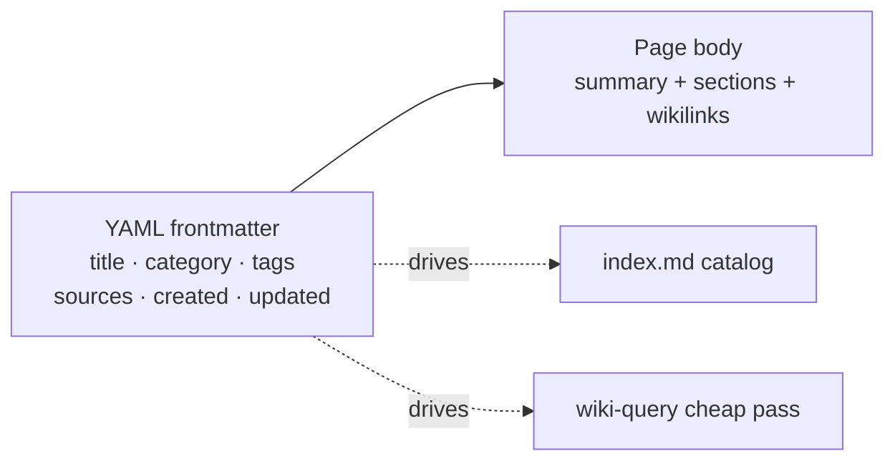

# Module 4.2: Page Frontmatter & Templates

> **Goal**: Learn what makes a file a valid wiki page — the required frontmatter, the page template shape, and the 5-tag limit.

---

## Frontmatter Is Required
Every wiki page starts with a YAML frontmatter block — a set of `key: value` lines between two `---` markers at the top of the file. This block is not optional. It is how the framework knows the page's title, where it belongs, and how to track it.



The frontmatter is what lets skills work cheaply. `wiki-query`, for example, can scan titles, tags, and the `summary:` field across the whole vault before it ever opens a page body. Without consistent frontmatter, that fast pass would not work.

---

## The Six Required Fields
### What every page must carry
A page is only valid if it has all six of these fields:

| Field | What it holds |
|---|---|
| `title` | The page's display name |
| `category` | Which category folder it lives in (`concepts`, `entities`, etc.) |
| `tags` | Domain/type tags (the controlled vocabulary) — max 5 |
| `sources` | Where the knowledge came from — provenance |
| `created` | ISO timestamp when the page was first written |
| `updated` | ISO timestamp of the last change |

Everything beyond these six is optional. The `llm-wiki` skill defines a richer template with extra fields — `aliases`, `summary`, `relationships`, `provenance`, `base_confidence`, `lifecycle`, `tier` — but a page without them is still valid. Pages missing any of the six required fields are not.

### The 5-tag limit
The `tags` field is capped at **5 tags**. This keeps tagging meaningful instead of letting pages collect a dozen loosely related labels. Tags come from the controlled vocabulary in `_meta/taxonomy.md`.

One important exception: `visibility/` tags (covered in [Module 4.4](4.4-visibility-model.md)) are **system tags**. They do not count toward the 5-tag limit and are listed separately in the taxonomy. So a page can carry up to 5 domain tags *plus* a `visibility/` tag.

---

## The Page Template
### The generic shape
When a skill creates a new page, it follows the template from the `llm-wiki` skill. The frontmatter shows the six required fields alongside the optional ones; the body opens with a one-paragraph summary, then sections, then linked sources.

```markdown
---
title: Page Title
category: concepts
tags: [ml, architecture]
aliases: [alternate name]
relationships:
  - target: "[[concepts/related-concept]]"
    type: extends
sources: [papers/attention.pdf]
summary: One or two sentences, ≤200 chars, so a reader (or another skill) can preview this page without opening it.
provenance:
  extracted: 0.72
  inferred: 0.25
  ambiguous: 0.03
base_confidence: 0.65
lifecycle: draft
lifecycle_changed: 2024-03-15
tier: supporting
created: 2024-03-15T10:30:00Z
updated: 2024-03-15T10:30:00Z
---

# Page Title

One-paragraph summary of what this page covers.

## Key Ideas

- The source's central claim, paraphrased directly.
- A generalization the source implies but doesn't state outright. ^[inferred]
- A figure two sources disagree on. ^[ambiguous]

Use [[wikilinks]] to connect to related pages.

## Open Questions

Things that are unresolved or need more sources.

## Sources

- [[references/attention-is-all-you-need]] — Original paper
```

### Reading the optional fields
You do not need to memorize the optional fields to use the vault, but it helps to know what they do:

- `summary` — a ≤200-character preview so a reader or skill can understand the page without opening the body.
- `relationships` — typed, directional edges (`extends`, `uses`, `contradicts`, and so on) that enrich plain wikilinks.
- `provenance` — rough fractions of how much of the page is extracted, inferred, or ambiguous.
- `base_confidence` and `lifecycle` — trust signals; new pages start as `draft`.
- `tier` — controls how often ingest re-reads the page; defaults to `supporting`.

A page in `references/` for an academic paper uses a richer "Paper Deep-Dive" body (architecture, equations, results table), but the frontmatter rules are identical — only the body sections differ.

---

## Key Takeaways
1. **Six fields are mandatory** - `title`, `category`, `tags`, `sources`, `created`, `updated` on every page; everything else is optional.
2. **Frontmatter powers the cheap pass** - skills scan titles, tags, and `summary:` before opening page bodies, which is what lets the framework scale.
3. **Tags are capped at 5** - drawn from the controlled vocabulary in `_meta/taxonomy.md`.
4. **`visibility/` tags are free** - system tags do not count toward the 5-tag limit and are tracked separately.
5. **The body opens with a summary** - one paragraph, then `## Key Ideas`, `## Open Questions`, `## Sources`, all connected with `[[wikilinks]]`.

---

## Next Module Preview
In **Module 4.3: Wikilinks & Special Files**, you will learn what turns a folder of pages into a knowledge graph: `[[wikilinks]]` as the edges, plus the four state files the system keeps current on every write.
- `[[wikilinks]]` vs markdown links and the `OBSIDIAN_LINK_FORMAT` switch
- What `index.md`, `log.md`, `hot.md`, and `.manifest.json` each hold
- Why every write skill updates all four
