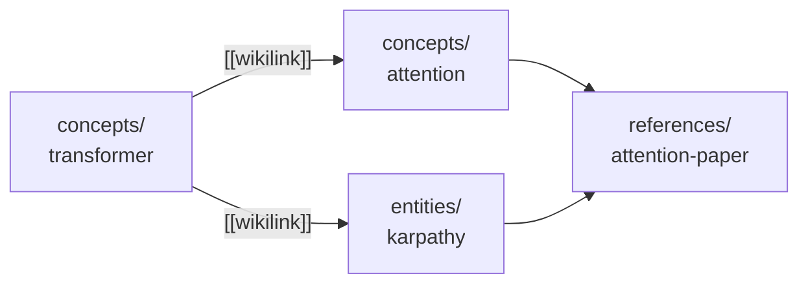

# Module 4.3: Wikilinks & Special Files

> **Goal**: Learn what turns a folder of pages into a knowledge graph — `[[wikilinks]]` as the edges — and what the four state files hold and why every write updates them.

---

## Links Are the Graph Edges
A vault is not just a pile of markdown files. The pages connect to each other through links, and those links are what make it a *knowledge graph* you can navigate in Obsidian rather than a flat folder. Every page is expected to link to its related pages.



By default links use Obsidian's `[[wikilink]]` syntax — `[[concepts/foo]]` or `[[concepts/foo|foo]]` with display text. When config sets `OBSIDIAN_LINK_FORMAT=markdown`, skills write standard markdown links instead — `[foo](../concepts/foo.md)` — computed relative to the current file. The default is `wikilink`. Every write skill reads this setting before generating links.

---

## The Four State Files
At the vault root sit four files that track the vault's overall state. They are not knowledge pages — they are the system's bookkeeping. Each holds a different view of what the vault contains and what has happened to it.

### `index.md` — the master catalog
A content-oriented catalog of every page, organized by category. Each entry has a one-line summary and its tags. It is the cheapest place for a skill (or a human) to find out what pages exist. Rebuilt after every ingest.

```markdown
# Wiki Index

## Concepts
- [[transformer-architecture]] — The dominant architecture for sequence modeling ( #ml #architecture)

## Entities
- [[andrej-karpathy]] — AI researcher, educator, former Tesla AI director ( #person #ml)
```

(Note the space after the opening `(` before tags — without it Obsidian's tag parsing breaks.)

### `log.md` — the chronological op log
An append-only, parseable record of every operation: ingests, queries, lints, archives, rebuilds. Each line is timestamped so you can reconstruct the vault's history.

```markdown
## Log

- [2024-03-15T10:30:00Z] INGEST source="papers/attention.pdf" pages_updated=12 pages_created=3
- [2024-03-16T09:00:00Z] LINT issues_found=2 orphans=1 contradictions=1
```

### `hot.md` — the warm semantic snapshot
A roughly 500-word snapshot of recent activity — a "hot cache." Its job is to let the next session pick up where the last one left off without crawling the whole vault first. Every write skill refreshes it.

### `.manifest.json` — the ingest ledger
Tracks every source file that has been ingested: its path, timestamps, and which wiki pages it produced (`pages_created`, `pages_updated`). This is the backbone of the delta system — it lets ingest skills compute *what is new* since last time instead of reprocessing everything. For project syncs it also stores `last_commit_synced`, so a repeat `wiki-update` only processes commits since the last sync.

The manifest enables four things:

- **Delta computation** — what is new or modified since the last ingest.
- **Append mode** — process only the delta, not the whole source set.
- **Audit** — which source produced which page.
- **Staleness detection** — a source changed but its page has not been updated.

One rule keeps it reliable: source keys are stored as **absolute paths with `~` and env vars expanded**, never `~`-relative. Mixing forms would let the same file be tracked twice and break the delta check.

---

## Why Every Write Updates All Four
### One write, four updates
A core operating principle is **track everything**. After any write operation, a skill updates `.manifest.json` (if it ingested a source), then `index.md`, `log.md`, and `hot.md`. This is not optional bookkeeping — each file would silently rot if left behind:

| File | If you skip updating it… |
|---|---|
| `index.md` | New pages are invisible to the cheap lookup pass; queries miss them |
| `log.md` | History has a gap; you cannot tell what happened or when |
| `hot.md` | The next session starts cold and must crawl the vault |
| `.manifest.json` | The delta check misses the source and re-ingests it next time |

The four files together are what let the framework stay fast and consistent **without a database**. They are the index, the history, the warm cache, and the ledger — maintained as plain files so Obsidian can read everything and nothing is proprietary.

---

## Key Takeaways
1. **Wikilinks are the edges** - `[[wikilinks]]` connect pages into a navigable graph; `OBSIDIAN_LINK_FORMAT=markdown` switches to relative markdown links.
2. **`index.md` is the catalog** - every page with a one-line summary and tags, rebuilt after every ingest.
3. **`log.md` is the history** - append-only, timestamped, parseable record of every operation.
4. **`hot.md` keeps context warm** - a ~500-word snapshot so the next session does not start from scratch.
5. **`.manifest.json` is the ledger** - tracks sources, the pages they produced, and `last_commit_synced`; it powers delta, append mode, audit, and staleness detection.

---

## Next Module Preview
In **Module 4.4: Visibility Model**, you will learn the optional layer that shapes how pages are surfaced without splitting the vault.
- The `visibility/` tags: `public`, `internal`, `pii`, and untagged = public
- Filtered mode and the phrases that trigger it
- Why visibility shapes surfacing but never duplicates or separates content
