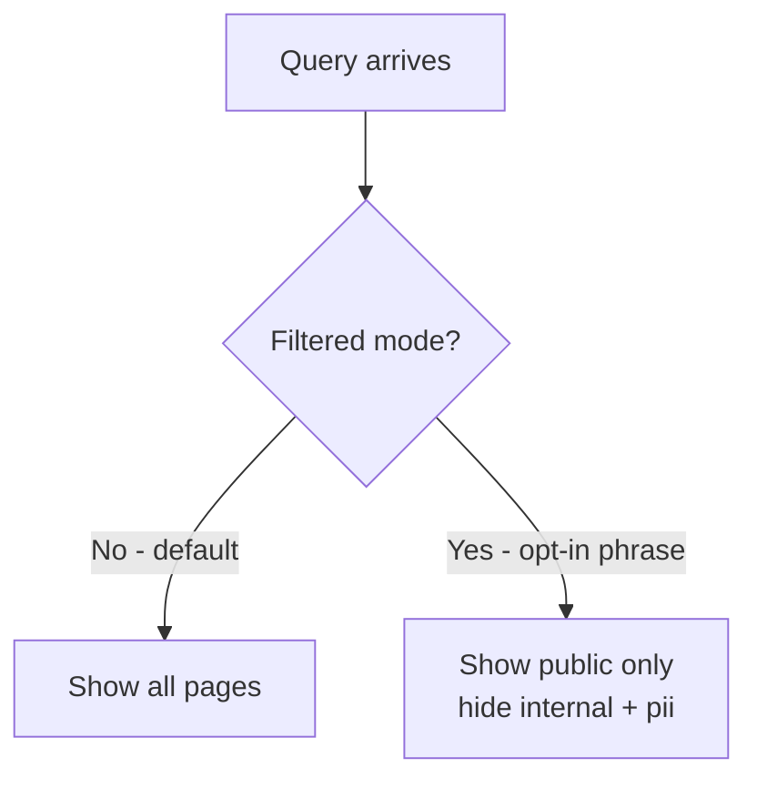

# Module 4.4: Visibility Model

> **Goal**: Learn the optional `visibility/` tags, the opt-in filtered mode, and why visibility shapes how content is surfaced without ever splitting the vault.

---

## Visibility Is Optional
The vault has one source of truth. The visibility model is an **optional** layer on top of it: you can mark a page with how far it should reach, but you never have to. A page with no visibility tag behaves exactly as it always has — visible everywhere.

This keeps the system single-vault and single source of truth. Visibility tags change *what gets surfaced* in a given query, not *what is stored* or *where*. Nothing is duplicated, moved, or split into a separate vault.

---

## The Visibility Tags
### The three levels
A page can carry one `visibility/` tag. There are three meanings, plus the untagged default:

| Tag | Meaning |
|---|---|
| *(no tag)* | Same as `visibility/public` — visible in all modes |
| `visibility/public` | Explicitly public — visible in all modes |
| `visibility/internal` | Team-only — excluded when querying in filtered mode |
| `visibility/pii` | Sensitive data — excluded when querying in filtered mode |

An untagged page is treated as public. So adding visibility tags to an existing vault is safe and incremental — pages you never touch keep behaving as public.

### Why they are "system tags"
`visibility/` tags are **system tags**, not domain tags. Two consequences follow from this (and both were introduced in [Module 4.2](4.2-page-frontmatter.md)):

- They do **not** count toward the 5-tag limit. A page can carry up to 5 domain tags *plus* a `visibility/` tag.
- They are listed **separately** from domain/type tags in `_meta/taxonomy.md`.

---

## Filtered Mode
### Default vs filtered
By default, queries show everything — public, internal, and pii pages all surface. **Filtered mode** is opt-in: it only turns on when the request signals it. Phrases that trigger it include:

- "public only"
- "user-facing answer"
- "no internal content"
- "as a user would see it"

When filtered mode is on, `visibility/internal` and `visibility/pii` pages are excluded from the answer. When it is off — the default — they are included. The skills that apply this filter are `wiki-query` (reading) and `wiki-export` (exporting).

### Single source of truth
The key design point: visibility never creates a second copy of anything. There is no "public vault" and "internal vault." There is one vault, and the visibility tag is a lens the query applies at read time. The same page can be hidden in one query (filtered mode) and shown in the next (default mode) — its storage never changes.

This is why the model is safe to adopt gradually. You are not reorganizing the vault; you are annotating reach, and the annotation only matters when someone explicitly asks for a filtered view.

---

## Key Takeaways
1. **Entirely optional** - untagged pages behave as public; you adopt visibility only where you need it.
2. **Three levels** - `public`, `internal`, `pii`; no tag means public.
3. **Filtered mode is opt-in** - triggered by phrases like "public only" or "user-facing answer"; default mode shows everything.
4. **System tags are free** - `visibility/` tags do not count toward the 5-tag limit and are tracked separately in the taxonomy.
5. **Single source of truth** - visibility shapes surfacing at read time; it never duplicates, moves, or splits content.

---

## Next Module Preview
You have now seen the full data model — the folder layout, the page frontmatter, the links and state files, and the visibility lens. **Phase 5: Core Workflows** turns to the operations that read and write that model.

In **Module 5.1: The Ingest Family**, you will learn how knowledge gets *into* the vault.
- `wiki-ingest` and the per-agent history ingest skills (`claude-`, `codex-`, `hermes-`, `openclaw-`, `copilot-history-ingest`)
- `data-ingest` and `ingest-url`
- How delta tracking via `.manifest.json` keeps ingests incremental
