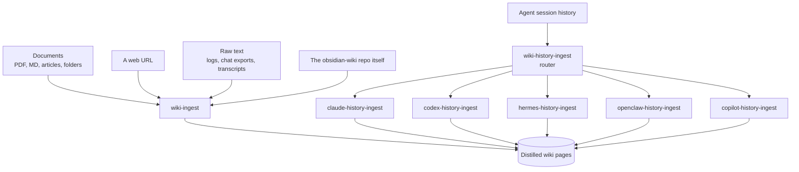
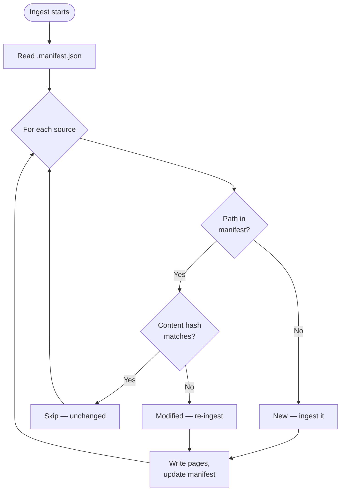

# Module 5.1: The Ingest Family

> **Goal**: Understand how every kind of source — documents, URLs, raw logs, and agent conversation history — flows into the vault as distilled, deduplicated pages.

---

## Getting Knowledge In

Everything you store in the wiki arrives through an *ingest* skill. Ingest skills do not copy source text into the vault. They **distill** it — pull out the durable knowledge, write it as interconnected pages, and throw away the noise (greetings, repeated back-and-forth, raw code dumps). The wiki is compiled knowledge, not an archive of your inputs.

There are two halves to the family. `wiki-ingest` is the **catch-all** for any document, URL, or text dump. The per-agent **history** skills mine the session folders that coding agents leave on your disk (`~/.claude`, `~/.codex`, `~/.hermes`, and so on), routed through one entrypoint called `wiki-history-ingest`.

---

## wiki-ingest — The Catch-All

`wiki-ingest` is the general ingest skill. Its description says it directly: it handles structured documents (PDFs, markdown, articles, papers, notes, whole folders), raw and unstructured text (chat exports, conversation logs, Slack/Discord threads, meeting transcripts, CSV/JSON data, journal entries, bookmarks, email archives), **and** web URLs. If a source is not covered by a more specific skill, this is the one that runs.

The earlier docs and routing table also name `data-ingest` (raw text/logs/transcripts), `ingest-url` (fetch and ingest a URL), and `obsidian-wiki-ingest` (the special case of ingesting this repo itself). These are the conceptual jobs `wiki-ingest` now covers — saying "ingest this data", "/ingest-url <url>", or "ingest the obsidian-wiki project" all route into `wiki-ingest`'s matching mode.

### Three modes

`wiki-ingest` runs in one of three modes. It infers the mode from context or asks you.

| Mode | When it runs | What it does |
|---|---|---|
| **Append** (default) | Normal day-to-day | Ingests only sources that are **new or modified** since last time |
| **Full** | You ask for it, or the manifest is missing/corrupt, or after a `wiki-rebuild` | Ingests everything regardless of manifest state |
| **Raw** | "process my drafts", or files dropped into `_raw/` | Promotes rough notes from the `_raw/` staging folder to proper pages, then deletes the originals |

### Distill, don't transcribe — and cap the output

The skill clusters extracted knowledge by **topic**, not by source. A 50-message debugging session might become a single `skills/` page about the fix. A long brainstorm might become three `concepts/` pages. Twenty screenshots of the same bug produce pages organized by subject, never one page per message.

There is a soft cap on volume. Before writing anything, the skill plans which pages to create or update and aims for **10–15 pages per ingest**. This keeps each run focused and prevents a single large source from flooding the vault.

When the topic already has a page, the skill **merges new material into the existing page** rather than creating a duplicate. This is the "compile, don't retrieve" principle in action.

---

## The History Family

Coding agents write your sessions to disk. The history-ingest skills mine those folders and turn past work into knowledge pages. You do not call them by name — you call the router.

### wiki-history-ingest — the router

`wiki-history-ingest` is a thin dispatcher for **session sources only**. It does not replace `wiki-ingest` for documents. You invoke it as `/wiki-history-ingest <target>` and it routes to the right specialist:

| Subcommand | Routes to | Mines |
|---|---|---|
| `claude` | `claude-history-ingest` | `~/.claude` conversations + memory files |
| `codex` | `codex-history-ingest` | `~/.codex` sessions + rollout files |
| `hermes` | `hermes-history-ingest` | **`~/.hermes` memories** |
| `openclaw` | `openclaw-history-ingest` | `~/.openclaw` sessions + `MEMORY.md` |
| `copilot` | `copilot-history-ingest` | `~/.copilot` sessions, `session-store.db` |

If you give a path instead of a name, the router infers the target from artifacts it recognizes (a `~/.hermes` path → `hermes-history-ingest`, a `session-store.db` → `copilot-history-ingest`, and so on). If it cannot tell, it asks one short question. After routing, the destination skill runs its own workflow end to end — the router never duplicates that logic.

> **Hermes is a first-class member.** `hermes-history-ingest` mines the memories under `~/.hermes`. Hermes appears in the routing table, in the fan-out targets, and gets its own ingest skill exactly like Claude, Codex, OpenClaw, and Copilot.

---

## Delta Tracking via .manifest.json

Every ingest skill reads `.manifest.json` at the vault root before doing anything. The manifest is the ingest ledger — it records every source file already processed: its absolute path, timestamps, content hash, and the pages it produced.

In **append mode**, `wiki-ingest` checks each source by both timestamp **and SHA-256 content hash**. If a path is not in the manifest, it is new. If the hash matches the recorded `content_hash`, the file is skipped even when its modification time changed — a `git checkout` or copy that touches the timestamp without changing content will not trigger redundant work. Only a genuine content change causes a re-ingest.

The history skills do the same with conversation files: they process only files not in the manifest, or whose modification time is newer than the recorded `ingested_at`. So re-running `/wiki-history-ingest claude` after a few new sessions captures just those sessions — the delta — not your entire history again.

> **Canonical paths matter.** Manifest keys are absolute paths with `~` expanded. The skills expand a source path the same way before deciding it is "new" — otherwise the same file tracked as `~/.claude/...` would look new when scanned as `/Users/me/.claude/...` and get ingested twice.

After writing pages, every ingest skill updates `.manifest.json`, `index.md`, `log.md`, and `hot.md` so the next run — and the next session — starts from an accurate picture.

---

## Key Takeaways
1. **Distill, don't transcribe** - Ingest skills extract durable knowledge and discard noise; the wiki stores compiled pages, not raw source copies.
2. **wiki-ingest is the catch-all** - One skill handles documents, URLs, and raw text/logs, in append (default), full, or raw mode.
3. **History has a router** - `wiki-history-ingest` dispatches to per-agent specialists for Claude, Codex, **Hermes**, OpenClaw, and Copilot session folders.
4. **The manifest prevents rework** - Append mode checks path + SHA-256 hash so re-runs process only new or genuinely changed sources.
5. **Volume is capped** - Each ingest aims for 10–15 topic-clustered pages and merges into existing pages instead of duplicating.

---

## Next Module Preview
In **Module 5.2: Query & Status**, you will see the read side of the loop:
- `wiki-query` — the cheap index-first pass that opens page bodies only when it must, and returns answers with `[[wikilink]]` citations
- Index-only fast mode and multi-hop link-walking for "how is X connected to Y" questions
- `wiki-status` — the delta audit (new / pending / stale) and its insights mode for hubs, bridges, and orphans
