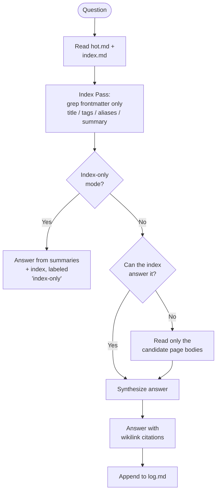

# Module 5.2: Query & Status

> **Goal**: Learn how to read knowledge back out of the vault with `wiki-query`, and how to check the vault's health and shape with `wiki-status`.

---

## wiki-query — Cheapest Pass First

`wiki-query` answers questions against the **compiled** wiki, not your raw sources. Because the knowledge is already synthesized and cross-referenced, the skill can usually answer without reading much. Its guiding rule: reading is the dominant cost, so use the cheapest retrieval primitive that works and escalate only when it cannot.

`wiki-query` is **read-only**. It answers questions; it never creates or edits pages. The single write it is allowed is one line appended to `log.md`. If your message contains a finding or asks for a change, the skill answers and then *proposes* the change, routing you to `wiki-capture` or `wiki-update` to actually make it.

### The tiered passes

The skill starts cheap and climbs only as needed:

1. **hot.md + index.md** — `hot.md` is a ~500-word snapshot of recent activity. If your question is about something ingested recently, this may answer it before any page is opened. `index.md` lists every page with a one-line description and tags.
2. **Index Pass (cheap)** — grep page **frontmatter only** (`title`, `tags`, `aliases`, `summary`) to build a candidate set of 5–10 pages. A frontmatter-scoped grep is far cheaper than scanning page contents.
3. **Page bodies (expensive)** — open the bodies of only the top candidates, and only when the index pass cannot answer.
4. **Synthesize** — write one answer drawing from the allowed pages, citing each with a `[[wikilink]]`.

### Index-only fast mode

Phrases like **"quick answer"**, **"just scan"**, **"don't read the pages"**, or **"fast lookup"** trigger index-only mode. The skill stops at the index pass and answers from `summary:` fields, titles, and `index.md` descriptions alone — no page bodies. The answer is labeled clearly so you know it may miss nuance:

> *(index-only answer — page bodies not read; facts below are from page summaries and may miss nuance)*

### Multi-hop link-walking

Some questions are about *connections*, not facts: "How is X connected to Y?", "Trace the chain from X to Z", "What does X depend on transitively?" Here X and Y do not link directly — the path runs through intermediate pages. `wiki-query` answers these by walking the typed edges (the `relationships:` frontmatter blocks and `[[wikilinks]]`) across multiple hops until it connects the two endpoints, then reports the chain it found.

The skill also honors **filtered mode**: if you say "public only" or "as a user would see it", it blocks `visibility/internal` and `visibility/pii` pages from the answer (covered in [Module 4.4](../4-knowledge-vault/4.4-visibility-model.md)).

---

## wiki-status — The Delta Audit

Where `wiki-query` reads *knowledge*, `wiki-status` reads the *state of the vault*. It compares what is available to ingest against what has already been ingested, so you can decide whether to append the delta or rebuild.

### The manifest as ground truth

`wiki-status` reads `.manifest.json` — the ingest ledger that records every source file processed, with timestamps, source type, and the pages each one produced. It then scans the live sources (documents in `OBSIDIAN_SOURCES_DIR`, Claude history in `CLAUDE_HISTORY_PATH`, Codex history in `CODEX_HISTORY_PATH`) and computes three buckets:

| Bucket | Meaning |
|---|---|
| **New** | Source present on disk but not in the manifest — never ingested |
| **Pending** | Known but not yet processed, or modified since last ingest |
| **Stale** | A page whose `updated` timestamp is older than the source it came from |

The result is a clear picture of the gap between your sources and your compiled vault.

### Insights mode

Phrases like **"wiki insights"**, **"what's central"**, **"show me the hubs"**, or **"wiki structure"** switch `wiki-status` into insights mode. Instead of the source delta, it analyzes the **shape of the wiki itself** and surfaces:

- **Hubs** — the most-linked pages, your load-bearing concepts
- **Cross-domain bridges** — pages that connect different categories
- **Orphan-adjacent pages** — pages on the edge of the graph, near to becoming disconnected islands

Insights mode is the diagnostic that tells you *where* the graph needs attention — which feeds directly into the maintenance skills in the next module.

---

## Key Takeaways
1. **Cheapest primitive first** - `wiki-query` reads `hot.md` and frontmatter before ever opening a page body, because reading is the dominant cost.
2. **Query is read-only** - It answers and cites with `[[wikilinks]]`; it proposes changes but routes you to `wiki-capture` or `wiki-update` to make them.
3. **Index-only mode trades depth for speed** - Triggered by "quick answer" / "just scan", it answers from summaries alone and labels the answer as such.
4. **Multi-hop walks the graph** - Connection questions traverse typed edges across intermediate pages to trace a chain from X to Y.
5. **Status splits into delta and insights** - The default audit reports new/pending/stale sources; insights mode reports hubs, bridges, and orphan-adjacent pages.

---

## Next Module Preview
In **Module 5.3: The Maintenance Loop**, you will see the skills that keep the graph healthy over time:
- `wiki-lint` — finds orphans, broken links, stale content, and contradictions, with a `--consolidate` act mode
- `cross-linker` — the write-heavy skill that adds missing `[[wikilinks]]` between pages that should connect
- `tag-taxonomy` — normalizes tags against the controlled vocabulary in `_meta/taxonomy.md`
- `wiki-synthesize` — turns recurring cross-concept patterns into new `synthesis/` pages
