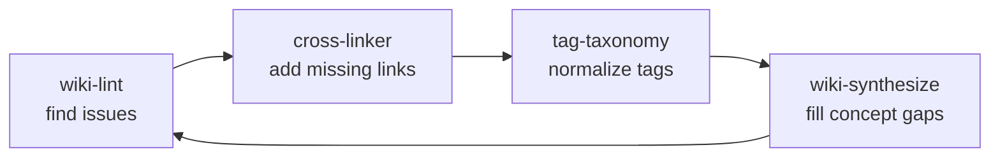

# Module 5.3: The Maintenance Loop

> **Goal**: Learn the four skills that keep the vault connected and drift-free as it grows — auditing, cross-linking, tag normalization, and synthesis.

---

## Why a Maintenance Loop

Ingesting adds pages. Over time those pages drift: links break when pages are renamed, new pages arrive disconnected from the rest, tags fork into near-duplicates, and recurring patterns never get written down. The maintenance loop is the set of skills that repair this drift and keep the knowledge graph tight.

One skill **reports** (`wiki-lint` in its default mode); the other three **write**. Together they answer a single question: is the graph still healthy, connected, and consistent?

---

## wiki-lint — The Health Audit

`wiki-lint` is the diagnostic. By default it reports issues and does not change anything. It runs a fixed set of checks, in order:

| Check | What it flags |
|---|---|
| **Orphaned pages** | Pages with zero incoming `[[wikilinks]]` — knowledge islands |
| **Broken wikilinks** | `[[links]]` that point to a page that does not exist |
| **Missing frontmatter** | Pages missing required fields (`title`, `category`, `tags`, `sources`, `created`, `updated`) |
| **Missing summary** | Pages without a `summary:` field — a *soft* warning, since older pages predate it |
| **Stale content** | Pages whose `updated` timestamp is older than the source they came from |
| **Contradictions** | Claims that conflict across pages |

To stay cheap on a large vault, `wiki-lint` uses frontmatter-scoped greps and section-anchored reads instead of reading every page in full — the same retrieval discipline `wiki-query` uses.

### --consolidate: the act mode

Add `--consolidate` to switch `wiki-lint` from report-only into **act-and-report** mode — the "dream cycle". In this mode it does not just list problems, it fixes them: repairs broken links, adds missing cross-references for orphans, corrects lifecycle states, demotes stale peripheral pages, normalizes tag aliases, and adds contradiction callouts. Every change goes through a **dry-run preview and explicit user confirmation** before anything is written. Nothing is touched until you approve.

---

## cross-linker — Weaving the Graph

`cross-linker` is **write-heavy** — unlike `wiki-lint`, which only reports, it actually edits pages to insert missing `[[wikilinks]]`. Its job is to find pairs of pages that *should* reference each other but currently do not, and connect them.

It works in three steps:

1. **Build the page registry** — grep frontmatter across the vault to collect each page's filename, title, aliases, tags, and category. Every entry is a valid link target — this is the linking "vocabulary".
2. **Scan for missing links** — read pages and look for unlinked mentions: a page that says "MyProject" in prose but never links to `[[my-project]]`, or two pages sharing several tags with no link between them. Matching is case-insensitive and diacritic-insensitive, skips self-references and common words, and never links inside code blocks.
3. **Score and rank** — each candidate link gets a composite score. An exact name match in body text scores high (+4); shared tags, same-project membership, and **cross-category** links (a `concepts/` page to an `entities/` page) all add points, because connecting different knowledge layers is more architecturally valuable. Connecting a peripheral page to a hub also scores extra.

Only links above the confidence threshold are added. The result is that newly ingested pages get woven into the existing graph instead of sitting as orphans.

---

## tag-taxonomy — One Vocabulary

Tags are how pages group across folders, but without discipline they fork: `nextjs`, `next-js`, and `react` end up meaning the same thing. `tag-taxonomy` enforces a **controlled vocabulary** defined in `$VAULT/_meta/taxonomy.md`.

That file is the source of truth. It lists the canonical tags, the aliases that map to them, the rules (max 5 tags per page, lowercase and hyphenated, prefer broad over narrow), and a migration guide for known renames. Any skill that assigns tags is expected to read it first.

In **audit mode**, `tag-taxonomy` scans every page, builds a frequency table, and flags unknown tags, alias tags (an alias used instead of the canonical form), over-tagged pages, and untagged pages — then reports the renames needed.

> **Visibility tags are exempt.** The `visibility/` group (`public`, `internal`, `pii`) is reserved. These tags do not count toward the 5-tag limit, are reported separately, and are left untouched during normalization — they are not subject to alias mapping. See [Module 4.4](../4-knowledge-vault/4.4-visibility-model.md).

---

## wiki-synthesize — Filling the Gaps

The first three skills keep what exists healthy. `wiki-synthesize` *adds* knowledge — but only the synthesizing kind. It looks for concepts that **co-occur** across many pages yet have no dedicated page connecting them, and writes new `synthesis/` pages that draw the cross-cutting conclusion.

It works by building a **co-occurrence map**: for every pair of concept or entity pages (A, B), it counts how many other pages link to *both*. High co-occurrence with no existing synthesis page is a gap. It scores candidates — co-occurrence count, cross-domain pairs, shared tags in different folders, hub involvement, and whether the synthesis would resolve a flagged contradiction all add points — then drafts pages for the top candidates in `synthesis/`, each citing the pages that linked to both concepts.

This is what turns a folder of related notes into genuine insight: the recurring pattern you kept circling gets its own page.

---

## How They Keep the Graph Drift-Free

Each skill targets a different kind of decay:

- **wiki-lint** finds the rot (orphans, broken links, staleness, contradictions) and, with `--consolidate`, fixes it.
- **cross-linker** stops new pages from becoming islands by adding the links ingest missed.
- **tag-taxonomy** stops the vocabulary from fragmenting so tag-based grouping stays meaningful.
- **wiki-synthesize** stops latent insight from staying buried across disconnected pages.

Run after a large ingest, they fold new material into the existing structure so the vault stays a connected graph, not a folder of files.

---

## Key Takeaways
1. **lint reports, the rest write** - `wiki-lint` only diagnoses by default; `cross-linker`, `tag-taxonomy`, and `wiki-synthesize` change pages.
2. **--consolidate is the act mode** - It fixes the issues lint finds, but always behind a dry-run preview and explicit confirmation.
3. **cross-linker is write-heavy by design** - It scores candidate links and inserts the high-confidence ones, weaving orphans into the graph.
4. **Tags follow one vocabulary** - `tag-taxonomy` normalizes against `_meta/taxonomy.md`; `visibility/` tags are reserved and left alone.
5. **synthesize fills gaps** - Concepts that co-occur but have no connecting page become new `synthesis/` pages that state the cross-cutting conclusion.

---

## Next Module Preview
In **Module 5.4: Cross-Project Skills**, you will see the two portable skills that work from any directory:
- `wiki-update` — scans the current project (README, source, git log, package metadata), distills the decisions and patterns, and writes to `$VAULT/projects/<name>.md`
- `wiki-query` — the same read skill, run from wherever you are working
- Why these two are the *only* skills installed globally into `~/.claude/skills/`
- How `last_commit_synced` lets repeat runs process only the git delta
