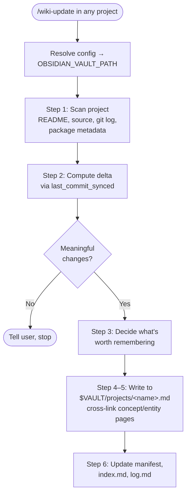

# Module 5.4: Cross-Project Skills

> **Goal**: Learn the two portable skills — `wiki-update` and `wiki-query` — that work from any directory and are the only ones installed globally.

---

## The Two Portable Skills

The main reason this framework exists is to capture knowledge from wherever you work and pull it back when you need it. You are usually inside *some other project*, not the obsidian-wiki repo. Two skills are built to run from anywhere:

- **`wiki-update`** — writes knowledge *out of* the current project *into* the vault.
- **`wiki-query`** — reads knowledge *out of* the vault, from any directory (covered in [Module 5.2](5.2-query-and-status.md)).

Both find the vault the same way: they follow the Config Resolution Protocol — walk up from the current directory for a `.env`, fall back to `~/.obsidian-wiki/config`, and read `OBSIDIAN_VAULT_PATH` from whichever is found. That global config is exactly what makes them portable.

> **These two are the only skills installed globally.** `setup.sh` symlinks the full skill set into each agent's project-local discovery path, but into `~/.claude/skills/` it installs *only* `wiki-update` and `wiki-query`. This keeps them available from any directory without polluting the global Claude Code skill list with the entire skill set.

---

## wiki-update — Sync a Project to the Vault

`wiki-update` distills what you have been building in the current project and writes it to the vault. It does not copy code. It captures the *reasoning* — the decisions, patterns, and trade-offs you would otherwise have to re-derive from `git blame` across twenty commits.



### What it scans and distills

`wiki-update` figures out what the project is by reading the `README.md` and docs, the source structure (frameworks, languages, key abstractions), the project metadata file (`package.json`, `pyproject.toml`, `go.mod`, `Cargo.toml`, whatever applies), and the git log — focusing on commit messages that signal decisions, not "fix typo" noise.

It keeps only durable knowledge. The heuristic from Karpathy's pattern is the test: *if reading the codebase answers the question, do not wiki it; if you would have to re-derive the reasoning, wiki it.*

| Worth distilling | Not worth distilling |
|---|---|
| Architecture decisions and *why* | File listings, obvious boilerplate |
| Patterns you would Google again | Individual bug fixes with no lesson |
| What the project depends on and how it is wired | Dependency versions, lock files |
| Key abstractions and the mental model | Details the code already states clearly |
| Trade-offs evaluated and what was picked | Routine changes readable from the diff |

### Where it writes

Project knowledge lands under `$VAULT/projects/<project-name>.md`, with cross-links to relevant global concept and entity pages so the project is woven into the rest of the graph. Then `wiki-update` updates the three state files every write touches: `.manifest.json`, `index.md`, and `log.md`.

### Delta via last_commit_synced

On the first run, everything is new — `wiki-update` does a full scan. On later runs it reads `last_commit_synced` from `.manifest.json` and processes only what changed since.

Before trusting that stored SHA, it checks the commit is still reachable:

```bash
git merge-base --is-ancestor <last_commit_synced> HEAD
```

- **Exit 0** — the SHA is an ancestor of HEAD. Safe. It runs `git log <last_commit_synced>..HEAD` to see the delta and distills only that.
- **Exit 1** — the SHA is no longer in this branch's history (a rebase or force-push happened). It warns you, falls back to a full scan, and resets `last_commit_synced` to the current HEAD at the end.

If nothing meaningful changed since the last sync, it tells you and stops — no empty writes.

---

## How the Two Work Together

The pair forms a complete cross-project loop. You finish a stretch of work in some repo, run `/wiki-update` to push the decisions into the vault, and weeks later — from a different project entirely — run a `wiki-query` to pull that reasoning back with `[[wikilink]]` citations. Neither skill needs you to be in the obsidian-wiki repo, because both resolve the vault path from the global config written at install time.

---

## Key Takeaways
1. **Two skills are portable** - `wiki-update` (write) and `wiki-query` (read) run from any directory by resolving the vault path from config.
2. **Only these two install globally** - `setup.sh` symlinks just `wiki-update` and `wiki-query` into `~/.claude/skills/`, keeping the global skill list clean.
3. **wiki-update distills reasoning, not code** - It captures decisions, patterns, and trade-offs — the things you cannot get back by re-reading the source.
4. **It writes to projects/ and updates state** - Output goes to `$VAULT/projects/<name>.md`, cross-linked, with manifest, index, and log all updated.
5. **last_commit_synced drives the delta** - Repeat runs process only `git log <last_commit>..HEAD`, with an ancestor check that falls back to a full scan after a rebase or force-push.

---

## Next Module Preview
In **Module 6.1: Adding or Modifying a Skill** ([../6-extending/6.1-adding-a-skill.md](../6-extending/6.1-adding-a-skill.md)), you move from *using* the framework to *extending* it:
- The four-step loop: create under `.skills/`, add routing to `AGENTS.md`, sync the agent rule files, re-run `setup.sh`
- How a new skill becomes discoverable across every agent
- Where the canonical source lives and why edits go there, never to a symlink
