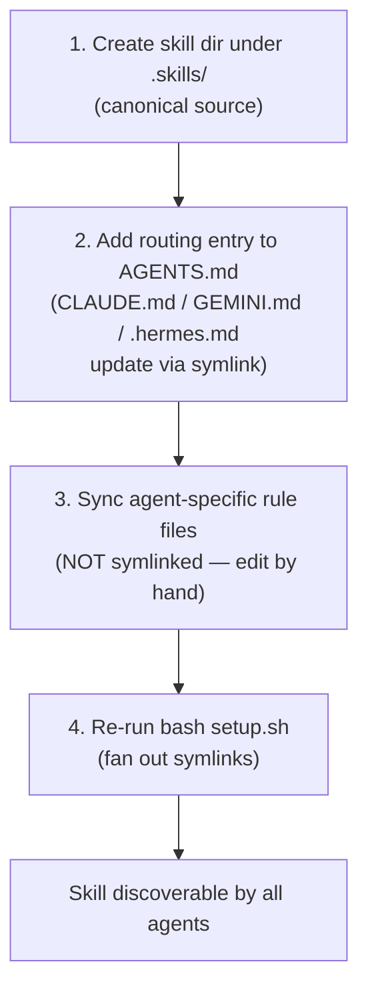

# Module 6.1: Adding or Modifying a Skill

> **Goal**: Learn the four-step loop to add or change a skill so every supported agent picks it up.

---

## The Four-Step Loop
A skill is just a folder of markdown instructions. To add or change one, you edit a single canonical source, then fan the change out to every agent. Because some files are symlinks and some are not, the order of steps matters.



The key idea: `.skills/` is the one place a skill's logic lives. `AGENTS.md` is the one place routing lives. A few agents read those directly through symlinks. The rest need a manual copy. Step 4 then makes the new skill folder visible in every agent's discovery directory.

---

## Step 1 — Create the Skill Directory
### Where it goes
Every skill lives under `.skills/<skill-name>/`. This is the **canonical source** — the single folder the framework treats as the truth for that skill.

### Skill anatomy
A skill has one required file and four optional subfolders:

```
.skills/<skill-name>/
├── SKILL.md            # required — the instruction body the agent executes
├── references/         # optional — supporting context loaded on demand
├── scripts/            # optional — helper scripts the skill may invoke
├── assets/             # optional — templates, examples, fixtures
└── agents/             # optional — sub-skill definitions
```

`SKILL.md` carries YAML frontmatter with a `name` and a `description`. The description is what an agent matches against when it decides whether to trigger the skill, so write it to cover the phrases a user would actually say.

### Using skill-creator
You can write the folder by hand, or invoke the `skill-creator` skill. It scaffolds a `SKILL.md`, helps you write the description for good triggering, and can run test prompts to check the skill fires when expected. Use it when you want help drafting; skip it when you just need a quick edit.

### Naming conventions
Pick a prefix that signals the skill's scope:

| Prefix | Meaning | Examples |
|---|---|---|
| `wiki-*` | Core wiki operations | `wiki-ingest`, `wiki-query`, `wiki-lint` |
| `*-history-ingest` | Per-tool conversation/session ingest | `claude-history-ingest`, `codex-history-ingest` |
| `*-ingest` | Generic ingest variants | `data-ingest`, `ingest-url` |

---

## Step 2 — Add a Routing Entry to AGENTS.md
An agent only invokes a skill if it knows when to. That mapping lives in the routing table inside `AGENTS.md`. Add a row that pairs an example user phrase with your skill name.

`AGENTS.md` is the **canonical context file**. `CLAUDE.md`, `GEMINI.md`, and `.hermes.md` are symlinks to it, created by `setup.sh`. So one edit to `AGENTS.md` updates the routing context for all those agents at once.

```
| User says something like…        | Skill          |
|----------------------------------|----------------|
| "do the new thing" / "/newthing" | my-new-skill   |
```

Never edit the symlinks (`CLAUDE.md`, `GEMINI.md`, `.hermes.md`) as if they were files. Edit `AGENTS.md` only.

---

## Step 3 — Sync Agent-Specific Rule Files
Not every agent reads `AGENTS.md`. Some keep their own "always-on" rule files in their own format, and these are **not symlinked**. If your skill needs always-on context (not just on-demand routing), copy the relevant context into each of these by hand:

| File | Agent |
|---|---|
| `.cursor/rules/obsidian-wiki.mdc` | Cursor |
| `.windsurf/rules/obsidian-wiki.md` | Windsurf |
| `.kiro/steering/obsidian-wiki.md` | Kiro |
| `.agent/rules/obsidian-wiki.md` | generic agent rules |
| `.agent/workflows/obsidian-wiki.md` | generic agent workflows |
| `.github/copilot-instructions.md` | GitHub Copilot |

These exist as separate files because each agent has its own frontmatter and directive format. Keep them in sync manually whenever conventions change. For a skill that only needs on-demand routing (the common case), the `AGENTS.md` entry from Step 2 is enough and you can skip this step.

---

## Step 4 — Re-run setup.sh
Run the installer again to fan out the new symlinks:

```bash
bash setup.sh
```

`setup.sh` symlinks `.skills/*` into every supported agent's project-local discovery directory (and the global directory for the two portable skills). It detects and replaces stale symlinks automatically, so re-running is safe. After this, your new skill folder is visible to every agent.

---

## Key Takeaways
1. **One canonical source** - A skill's logic lives only in `.skills/<name>/`; never duplicate it per agent.
2. **SKILL.md is required, the rest is optional** - `references/`, `scripts/`, `assets/`, `agents/` are added only when the skill needs them.
3. **AGENTS.md routes, symlinks propagate** - One routing edit reaches `CLAUDE.md`, `GEMINI.md`, and `.hermes.md` because they are symlinks to `AGENTS.md`.
4. **Some rule files are manual** - Cursor, Windsurf, Kiro, the `.agent/` files, and Copilot's instructions are not symlinked and must be kept in sync by hand.
5. **setup.sh is the fan-out step** - Re-running it makes new skills discoverable everywhere and fixes stale symlinks.

---

## Next Module Preview
You can now add a skill. Module 6.2 covers running the framework on a schedule: the macOS launchd cron, the `daily-update.sh` wrapper, and the terminal notification helper — see [6.2 Automation](6.2-automation.md). (For how the two portable skills run from any directory, revisit [Module 5.4 Cross-Project Skills](../5-workflows/5.4-cross-project-skills.md).)
