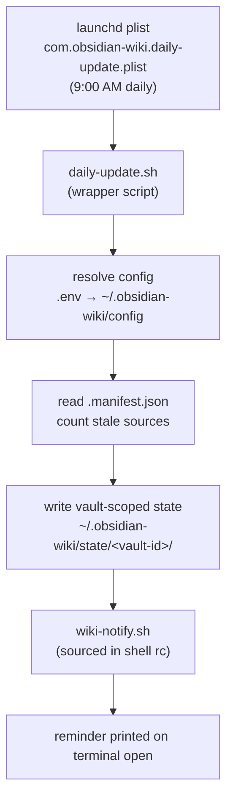

# Module 6.2: Automation (daily-update)

> **Goal**: Learn how the optional macOS cron keeps the wiki fresh and reminds you when sources have new content.

---

## What the Automation Does
The framework has no always-running server. The one piece of scheduled automation is optional: a macOS launchd job that runs once a day, checks whether any ingested source has changed since the last run, and writes a small state file. A shell hook then reads that state and prints a reminder when you open a terminal.



There are three files involved: the plist (the schedule), `daily-update.sh` (the work), and `wiki-notify.sh` (the reminder). Nothing here is required to use the wiki — it just removes the need to remember to check freshness.

---

## The launchd Plist
### scripts/com.obsidian-wiki.daily-update.plist
launchd is the macOS service that runs jobs on a schedule. The plist is an XML file that tells launchd what to run and when. The shipped plist runs `daily-update.sh` at 9:00 AM every day:

```xml
<key>ProgramArguments</key>
<array>
  <string>/bin/bash</string>
  <string>OBSIDIAN_WIKI_REPO/scripts/daily-update.sh</string>
</array>

<key>StartCalendarInterval</key>
<dict>
  <key>Hour</key>
  <integer>9</integer>
  <key>Minute</key>
  <integer>0</integer>
</dict>
```

The literal `OBSIDIAN_WIKI_REPO` token is a placeholder. The comment in the file says it is "Substituted automatically by /daily-update setup mode — do not edit manually." Standard output and errors go to `/tmp/obsidian-wiki-daily.log` and `/tmp/obsidian-wiki-daily.err`, which is where you look if a run misbehaves.

---

## The Wrapper Script
### scripts/daily-update.sh
This is what launchd actually runs. It is a self-contained bash script (`set -euo pipefail`) that does not depend on an agent being present. Its steps:

1. **Resolve config** the same way the skills do — walk up from the current directory for a `.env` containing `OBSIDIAN_VAULT_PATH`, then fall back to `~/.obsidian-wiki/config`. If neither exists, it exits with an error telling you to run `wiki-setup`.
2. **Derive a vault-scoped state dir** by hashing the vault path with `md5sum`/`md5`, giving `~/.obsidian-wiki/state/<vault-id>/`. This lets several vaults track freshness independently.
3. **Count stale sources** — read `.manifest.json`, take its `last_updated` timestamp, and (using a small inline Python block) compare each source's file modification time against it. A source is stale when its `mtime` is newer than the last ingest.
4. **Write state files** into the vault's state dir:

| File | Contents |
|---|---|
| `.last_update` | Unix timestamp of this run |
| `.pending_delta` | count of stale sources |
| `.vault_path` | the resolved vault path (so the notifier can label it) |

The script only measures and records freshness — it does not ingest. Ingesting stays a deliberate action you take.

---

## The Terminal Notification
### scripts/wiki-notify.sh
You source this from your shell's rc file (`source /path/to/obsidian-wiki/scripts/wiki-notify.sh` for zsh/bash). On every terminal open it scans all vault state dirs under `~/.obsidian-wiki/state/`. For any vault whose `.last_update` is more than 20 hours old, it prints a short box:

```
┌─ wiki: last synced 23h ago · my-vault · 2 source(s) have new content
│  /wiki-history-ingest claude   sync Claude sessions
│  /wiki-status                  see full delta
└─ /memory-bridge diff           compare tool memories
```

Because state is scoped per vault, the notifier shows every stale vault, not just one. If nothing is stale, it stays quiet.

---

## Installing the Cron via the Skill
You do not edit the plist by hand. You tell your agent:

```
/daily-update set up the daily cron
```

This triggers the `daily-update` skill in its setup mode. Behind the scenes it installs `scripts/com.obsidian-wiki.daily-update.plist` through `launchctl`, substituting the real repo path for the `OBSIDIAN_WIKI_REPO` placeholder, and wires `daily-update.sh` to run on the 9 AM schedule. The same skill, run without "set up", performs the daily maintenance cycle itself (freshness check, index refresh, `hot.md` update, state write) and even spawns `impl-validator` to self-check its output before reporting.

---

## Key Takeaways
1. **Automation is optional and macOS-only** - The launchd plist is the single scheduled component; the wiki works fully without it.
2. **Three files, three jobs** - the plist schedules, `daily-update.sh` measures freshness and writes state, `wiki-notify.sh` reminds you on terminal open.
3. **It measures, it does not ingest** - the cron only records which sources changed; you still trigger the actual ingest.
4. **State is vault-scoped** - hashing the vault path lets multiple vaults track freshness side by side under `~/.obsidian-wiki/state/`.
5. **Install through the skill, not by hand** - "/daily-update set up the daily cron" substitutes the repo path and registers the job via `launchctl`.

---

## Next Module Preview
With a skill added and the schedule running, the last question is how you check that your changes are correct. Module 6.3 covers operational validation — `wiki-lint`, `wiki-status`, `impl-validator`, and the `wiki-rebuild` safety net — plus a troubleshooting table for the common symlink and config problems. See [6.3 Validation & Troubleshooting](6.3-validation-and-troubleshooting.md).
