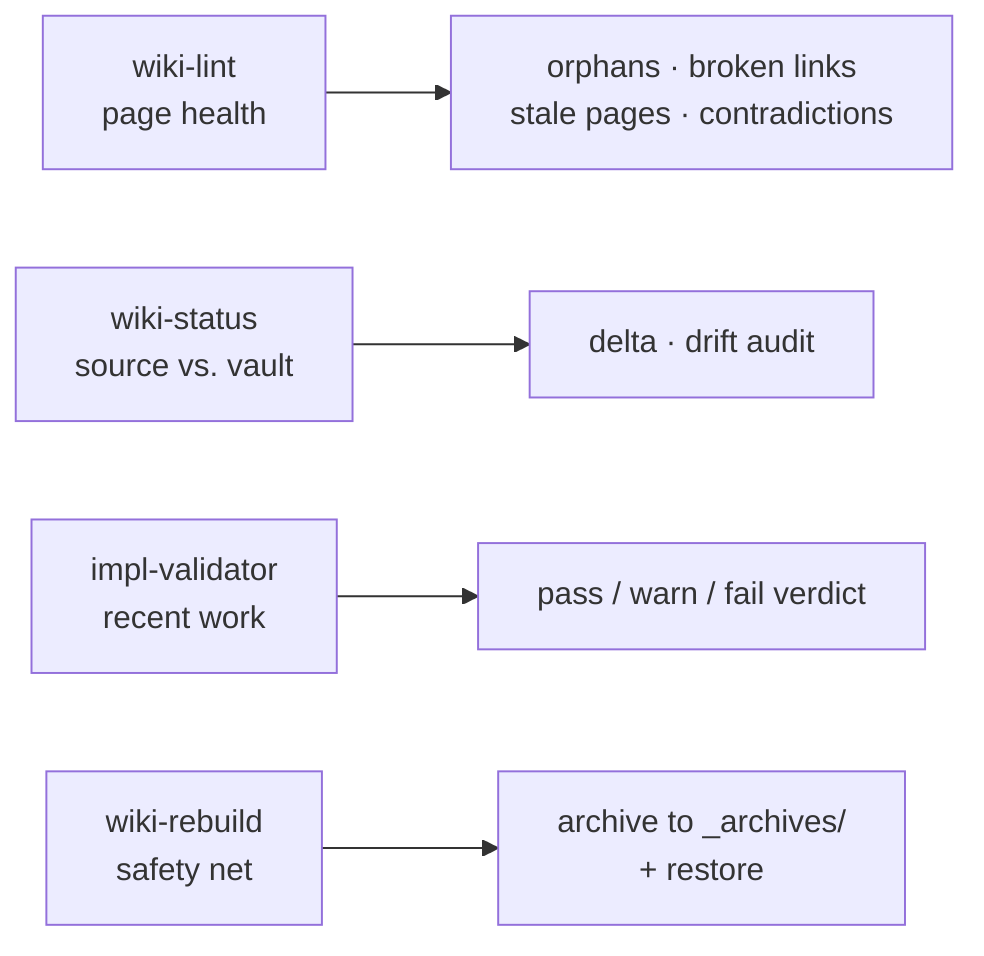

# Module 6.3: Validation & Troubleshooting

> **Goal**: Learn how to validate the wiki without a test runner, and how to fix the common symlink and config problems.

---

## Validation Is Operational
There is no test suite and no test runner. Nothing here compiles or unit-tests. Instead, validation is **operational**: you run skills against the real (or a small test) vault and inspect what changed. Four skills give you that coverage, each checking a different surface.

Think of it as four lenses: `wiki-lint` checks the pages, `wiki-status` checks pages against their sources, `impl-validator` checks the agent's own recent edits, and `wiki-rebuild` is the undo button that makes the other three safe to trust.

---

## The Four Validation Skills
### wiki-lint — page health
Audits the compiled pages and reports problems without (by default) changing anything. It finds:

- **Orphans** — pages no page links to.
- **Broken `[[wikilinks]]`** — links pointing at pages that do not exist.
- **Stale pages** — content older than its sources.
- **Contradictions** — pages that disagree with each other.

Run it after any large ingest, or when you suspect the graph has frayed. (It has an `--consolidate` mode that switches from report-only to fixing issues, with a dry-run preview first.)

### wiki-status — source vs. vault
Audits the **delta**: what is in your sources versus what has been compiled into pages. It reports drift — sources that changed since last ingest, pages with no remaining source, and how complete the compile is. Use it before deciding whether to ingest incrementally or rebuild.

### impl-validator — self-review of recent work
A meta-skill. After an agent does work (adds a skill, runs the daily update, edits pages), you ask it to validate its own output: "check this implementation", "did you do this right?". It restates the goal, checks each artifact for existence, completeness, correctness, and convention, then returns a structured **PASS / WARN / FAIL** verdict with specific issues. Other skills (like `daily-update`) spawn it automatically as a subagent before showing you results.

### wiki-rebuild — the safety net
The reason the other skills are safe to run boldly. Before any destructive operation, `wiki-rebuild` snapshots the entire wiki state into a timestamped directory under `$VAULT/_archives/` (each archive carries an `archive-meta.json`). It supports three modes: archive only, archive + rebuild from sources, and restore from a previous archive. Nothing is ever lost — you can always bring back an earlier state.

### Iterating on a skill
The recommended manual loop when changing a skill:

1. Edit `.skills/<name>/SKILL.md`.
2. Run the skill against a small test vault (or your real vault if you trust the change).
3. Inspect the resulting pages, `index.md`, `log.md`, and `.manifest.json` deltas.
4. Run `wiki-lint` to confirm no regressions elsewhere in the vault.

---

## Troubleshooting
Most real-world problems are about symlinks (skills not being found) or config (the vault not being found). This table maps each symptom to its cause and fix.

| Symptom | Likely cause | Fix |
|---|---|---|
| Skill not discovered by agent | Symlink missing or stale | Re-run `bash setup.sh`. It detects and replaces stale symlinks. |
| `setup.sh` warns "is a real directory, skipping symlink" | A previous manual install left a real dir where a symlink should be | Inspect the directory; remove or merge its contents, then re-run `setup.sh`. |
| On Windows, skill files appear as text containing a path | Git wrote symlinks as regular files (no `core.symlinks=true`) | Enable `git config --global core.symlinks true`, then re-run `setup.sh` — it detects this and replaces them with real symlinks. |
| Skills can't find the vault | `OBSIDIAN_VAULT_PATH` missing | Check `.env`, then `~/.obsidian-wiki/config`. Re-run `setup.sh` to re-prompt. |
| `.hermes.md` content drifted from `AGENTS.md` | Someone edited the symlink as if it were a regular file | Edit `AGENTS.md` instead. `setup.sh` rewrites `.hermes.md` as a symlink on every run. |

The recurring theme: when something is off with discovery or context, **re-run `bash setup.sh`**. It is idempotent and repairs stale symlinks, replaces text-file symlinks, and rewrites `.hermes.md` as a link to `AGENTS.md`.

---

## Key Takeaways
1. **No test runner — validation is operational** - you run skills against a vault and inspect deltas, not assertions.
2. **Four lenses** - `wiki-lint` (pages), `wiki-status` (sources vs. pages), `impl-validator` (recent work), `wiki-rebuild` (safety net).
3. **impl-validator returns PASS / WARN / FAIL** - it checks existence, completeness, correctness, and convention, and other skills spawn it automatically.
4. **wiki-rebuild means nothing is lost** - every destructive op snapshots to `$VAULT/_archives/` and restore is always available.
5. **When discovery breaks, re-run setup.sh** - it repairs stale symlinks, fixes Windows text-file symlinks, and rewrites `.hermes.md`.

---

## Where to Go Next
You have reached the end of the modules. To keep the whole system in view at a glance, use the [Cheat Sheet](../cheat-sheet.md) for the skill map, vault layout, config resolution flow, and command quick reference, and the [Glossary](../glossary.md) for precise definitions of terms like *fan-out*, *Config Resolution Protocol*, *manifest*, and *hot cache*.

Best of all, try the workflows hands-on: run `bash setup.sh`, set up a vault, ingest a source, ask `wiki-query` a question, run `wiki-lint`, and add a small skill of your own. The framework is just markdown instructions — reading a `SKILL.md` and editing it is the fastest way to understand it.
