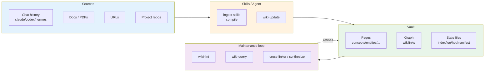
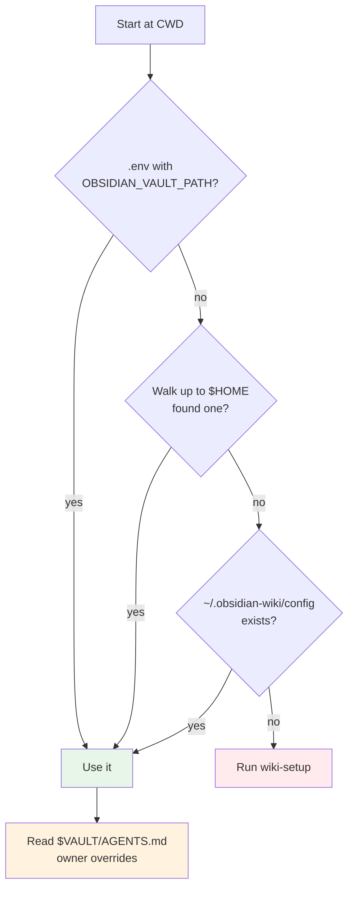

# obsidian-wiki Cheat Sheet

Quick reference with visual diagrams for the obsidian-wiki framework.

---

## Architecture



---

## Vault Structure

```
$OBSIDIAN_VAULT_PATH/
├── index.md            # master index — every page listed
├── log.md              # chronological activity log
├── hot.md              # ~500-word semantic snapshot of recent work
├── .manifest.json      # tracks every ingested source + delta
├── _meta/              # taxonomy.md + *.base dashboards
├── _raw/               # staging area — drafts promoted on next ingest
├── _archives/          # full snapshots from wiki-rebuild
├── concepts/           # abstract ideas, patterns, mental models
├── entities/           # concrete things — people, tools, libraries
├── skills/             # how-to knowledge, techniques
├── references/         # factual lookups — specs, APIs, configs
├── synthesis/          # cross-cutting analysis
├── journal/            # time-bound entries — daily/session notes
└── projects/           # one page per project (via wiki-update)
```

---

## Repo Structure

```
obsidian-wiki/
├── .skills/                # ★ CANONICAL SOURCE — 31 skills (edit here only)
│   └── <name>/SKILL.md
├── .claude/skills/         # symlink fan-out → ../.skills/<name>/
├── .cursor/skills/         # (same for windsurf, agents, kiro)
├── .windsurf/skills/
├── .agents/skills/
├── .kiro/skills/
├── AGENTS.md               # ★ CANONICAL agent context + routing table
├── CLAUDE.md → AGENTS.md   # symlinks (also GEMINI.md, .hermes.md)
├── setup.sh                # ★ ENTRY POINT — symlink fan-out + config writer
├── .env.example            # config template
├── .env                    # local config (gitignored)
└── scripts/                # daily-update.sh, *.plist, wiki-notify.sh
```

---

## Page Frontmatter

```markdown
---
title: Page Title
category: concepts          # concepts|entities|skills|references|synthesis|journal
tags: [domain/x, type/y]    # max 5 domain/type tags; visibility/ tags extra
sources: [path/or/url]
created: 2026-06-17
updated: 2026-06-17
---
```

---

## Skill Map

| Group | Skill | Purpose |
|-------|-------|---------|
| Setup/lifecycle | `wiki-setup` | Initialize vault structure + config |
| | `wiki-rebuild` | Archive → clear → rebuild, or restore |
| | `wiki-switch` | Switch between multiple vault profiles |
| | `daily-update` | Morning sync; install macOS cron + notify |
| Ingest | `wiki-ingest` | Catch-all: docs, raw text, URLs |
| | `wiki-history-ingest` | Router → per-agent history skills |
| | `claude/codex/hermes/openclaw/copilot/pi-history-ingest` | Mine an agent's session history |
| | `data-ingest` / `ingest-url` | Raw text dumps / single URL |
| | `obsidian-wiki-ingest` | Ingest this repo itself |
| Read/query | `wiki-query` | ★ Cited answers from compiled pages |
| | `wiki-status` | Delta audit + insights mode |
| | `wiki-research` | Multi-round web research → vault |
| | `wiki-digest` | Newsletter-style learning summary |
| Maintain | `wiki-lint` | Orphans, broken links, stale, contradictions |
| | `cross-linker` | Add missing `[[wikilinks]]` |
| | `tag-taxonomy` | Normalize tags vs `_meta/taxonomy.md` |
| | `wiki-synthesize` | Co-occurring concepts → synthesis pages |
| Capture | `wiki-capture` | File current conversation into vault |
| Export/visualize | `wiki-export` | graphml / neo4j / html / OKF |
| | `graph-colorize` | Color Obsidian graph by tag/category |
| | `wiki-dashboard` | Obsidian Bases / Dataview views |
| Memory | `memory-bridge` | Cross-tool memory browse + diff |
| Validation | `impl-validator` | Self-review an implementation |
| Meta | `llm-wiki` | ★ Core pattern + Config Resolution Protocol |
| | `skill-creator` | Scaffold a new skill |
| | `wiki-agent` | `/wiki-claude` etc. — per-tool research |

---

## Common Intents → Skill

| User says | Skill |
|-----------|-------|
| "set up my wiki" / "initialize" | `wiki-setup` |
| "ingest this" / "add these docs" | `wiki-ingest` |
| "/ingest-url <url>" | `ingest-url` |
| "import my Claude history" | `claude-history-ingest` |
| "/wiki-history-ingest codex" | `wiki-history-ingest` |
| "what do I know about X" | `wiki-query` |
| "what's the status" / "delta" | `wiki-status` |
| "audit" / "lint" / "broken links" | `wiki-lint` |
| "link my pages" | `cross-linker` |
| "fix my tags" | `tag-taxonomy` |
| "/wiki-update" / "sync to wiki" | `wiki-update` |
| "save this" / "/wiki-capture" | `wiki-capture` |
| "/wiki-hermes X" / "/wiki-codex X" | `wiki-agent` |
| "synthesize my wiki" | `wiki-synthesize` |
| "export graph" / "graphml" | `wiki-export` |
| "/memory-bridge" / "compare tool memories" | `memory-bridge` |
| "rebuild" / "start over" | `wiki-rebuild` |
| "/wiki-switch NAME" | `wiki-switch` |

---

## Essential Commands

```bash
bash setup.sh                       # install: symlink skills into every agent path + write config
npx skills add Ar9av/obsidian-wiki  # alternative install via skills registry

# Natural-language triggers (typed to the agent, not the shell):
# "set up my wiki"            -> wiki-setup    (one-time vault init)
# "what's the status?"        -> wiki-status   (delta sources vs vault)
# "ingest the new stuff"      -> wiki-ingest   (compile sources into pages)
# "what do I know about X?"   -> wiki-query    (cited answer)
# "audit my wiki"             -> wiki-lint     (orphans, broken links, stale)
# /wiki-update                -> wiki-update   (sync current project; any directory)
# /wiki-hermes <topic>        -> wiki-agent    (pull topic from Hermes history)
```

---

## Config Resolution



---

## Config Variables

| Variable | Default | Purpose |
|----------|---------|---------|
| `OBSIDIAN_VAULT_PATH` | *(required)* | Absolute path to the vault |
| `OBSIDIAN_CATEGORIES` | `concepts,entities,skills,references,synthesis,journal` | Category dirs created in vault |
| `OBSIDIAN_MAX_PAGES_PER_INGEST` | `15` | Cap on pages created/updated per ingest |
| `OBSIDIAN_LINK_FORMAT` | `wikilink` | `wikilink` or `markdown` link style for new writes |
| `LINT_SCHEDULE` | `weekly` | `daily` \| `weekly` \| `manual` |
| `OBSIDIAN_RAW_DIR` | `_raw` | Staging dir for draft pages |
