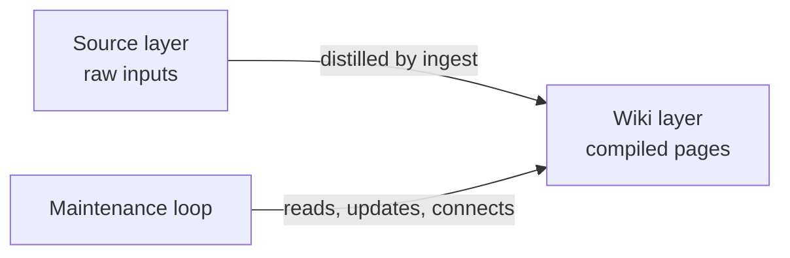
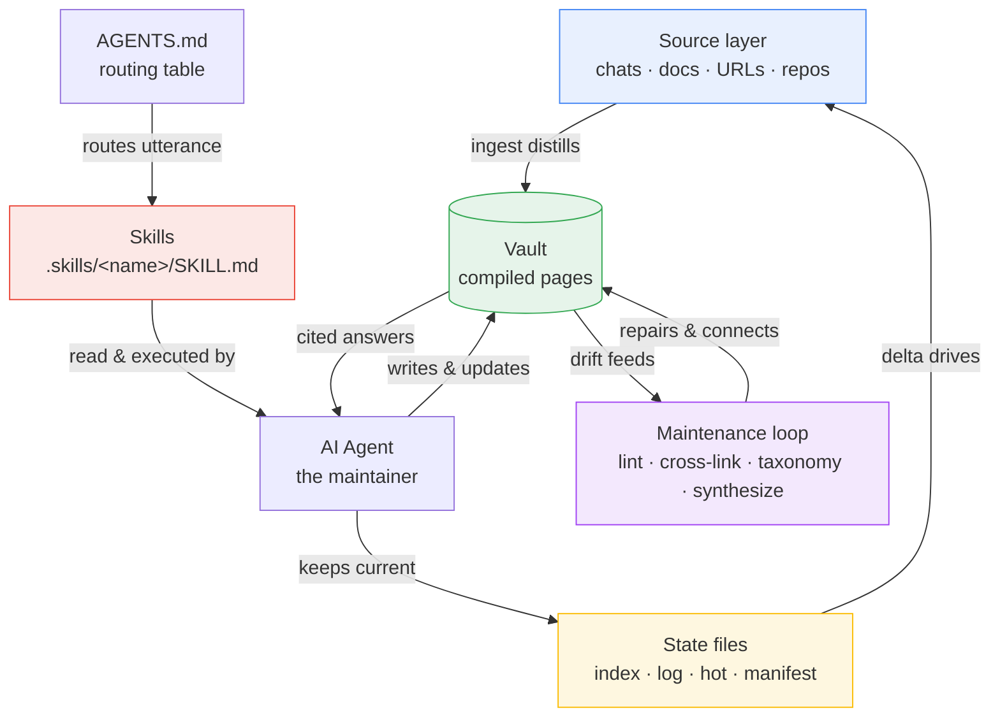

# obsidian-wiki Glossary

A comprehensive reference of terms, concepts, and comparisons for the obsidian-wiki framework.

---

## Core Concepts

### obsidian-wiki
A skill-based framework for building and maintaining an Obsidian knowledge base with any AI coding agent. It implements the "LLM Wiki" pattern: knowledge is compiled once into linked markdown pages, then maintained over time.

**Key characteristics:**
- A bundle of markdown instruction files plus one Bash installer (`setup.sh`) — not an application.
- The agent supplies execution; the framework only describes the work.
- Output is plain Obsidian markdown, readable in any text editor.

See also: [Skill](#skill), [Vault](#vault), [setup.sh](#setupsh)

### Instruction-Based Framework
A design where the program is markdown and the AI agent is the runtime. Nothing of obsidian-wiki's own ever runs; the host agent reads the instructions and executes them.

**Key characteristics:**
- No runtime, no API server, no build step, no package manifest.
- The whole tech stack is markdown plus a little Bash.
- `SKILL.md` bodies address the agent directly ("You are ingesting…") because the agent is the runtime.

See also: [Skill](#skill), [SKILL.md](#skillmd)

### LLM Wiki Pattern
The pattern obsidian-wiki is built on, from Andrej Karpathy's public gist. A language model is best used to distill knowledge once, not to answer the same question repeatedly from scratch.

**Key characteristics:**
- Source of the "compile, don't retrieve" idea.
- Origin gist: <https://gist.github.com/karpathy/442a6bf555914893e9891c11519de94f>.
- Frames the wiki as the compiled artifact a model produces once.

See also: [Compile, Don't Retrieve](#compile-dont-retrieve), [Three-Layer Architecture](#three-layer-architecture)

### Compile, Don't Retrieve
The first core operating principle. The wiki is treated as pre-compiled knowledge: ingesting a source updates existing pages instead of regenerating an answer or dumping a fresh summary.

**Key characteristics:**
- Same model as compiled code versus an interpreter — heavy work done once, read cheaply many times.
- "Update existing pages — don't append or duplicate."
- Buys three things: speed, consistency, and a navigable graph.

| Model | Cost per query | Answer stability |
|---|---|---|
| Retrieve every time | Full model cost again | May differ each time |
| Compile once | Cheap read of markdown | Identical every read |

See also: [Compound Over Time](#compound-over-time), [Knowledge Graph](#knowledge-graph)

### Compound Over Time
The second core principle. Each ingest should make the wiki smarter, not just bigger — new information merges into existing pages, resolves contradictions, and strengthens cross-links.

**Key characteristics:**
- A second source on the same topic merges into the existing page, never creates a duplicate.
- Pages get richer and better connected over runs.

See also: [Compile, Don't Retrieve](#compile-dont-retrieve), [Ingest](#ingest)

### Three-Layer Architecture
The three layers obsidian-wiki operates on: Source (raw inputs), Wiki (compiled pages), and the Maintenance loop (skills that keep pages connected and fresh).

**Key characteristics:**
- Like building software: Source is the source code, Wiki is the compiled artifact, the Maintenance loop is the build-and-test cycle.
- Sources are immutable; the system never modifies them.



See also: [Source Layer](#source-layer), [Maintenance Loop](#maintenance-loop), [Vault](#vault)

### Knowledge Graph
The connected form of the compiled wiki. Pages link to each other with `[[wikilinks]]`, so the knowledge is a navigable graph, not a folder of isolated files.

**Key characteristics:**
- Optional typed relationships (`extends`, `uses`, `contradicts`) add direction and meaning to edges.
- Lets the wiki answer multi-hop "how is X connected to Y" questions by walking links instead of re-querying a model.

See also: [Wikilink](#wikilink), [Multi-Hop Link-Walking](#multi-hop-link-walking)

### Three Roles
The framing that makes the system easy to reason about: **the wiki is the artifact, the agent is the maintainer, Obsidian is the viewer.**

**Key characteristics:**
- Wiki = the compiled pages, the thing of value (holds value even with no agent running).
- Agent = ingests, links, lints, keeps it current.
- Obsidian = renders the graph; you read and explore here.

---

## Skills & Routing

### Skill
The core unit of obsidian-wiki: a folder of markdown instructions an AI agent reads and then executes step by step. Not code that runs.

**Key characteristics:**
- Lives at `.skills/<name>/`; the only required file is `SKILL.md`.
- Everything else in the folder is optional context loaded on demand.
- 30-plus skills ship in the repo.

See also: [SKILL.md](#skillmd), [Canonical Source](#canonical-source), [references/ scripts/ assets/ agents/](#references-scripts-assets-agents)

### SKILL.md
The one required file in a skill. Starts with YAML frontmatter holding the skill `name` and a long `description`; the body is the numbered-step instructions for the agent.

**Key characteristics:**
- `description` lists the trigger phrases the agent matches against to decide when to run.
- The body is written to the agent directly — the markdown is the program.

```yaml
---
name: wiki-ingest
description: >
  Ingest any source into the Obsidian wiki ...
---
```

See also: [Skill](#skill), [Skill Routing](#skill-routing)

### references/ scripts/ assets/ agents/
The four optional subfolders of a skill, read only when a step in `SKILL.md` points to them.

**Key characteristics:**
- `references/` — extra on-demand context (e.g. `wiki-ingest` ships three).
- `scripts/` — optional Bash/JS helpers; most skills have none.
- `assets/` — templates, examples, fixtures.
- `agents/` — sub-skill definitions for sub-agents a skill can spawn.
- `skill-creator` is the one skill that uses every optional part.

See also: [Skill](#skill), [Sub-Skill](#sub-skill)

### Sub-Skill
A sub-agent definition a skill can spawn for a focused subtask, stored in the skill's `agents/` folder.

**Key characteristics:**
- `skill-creator` is the clearest example.
- `impl-validator` is spawned automatically as a subagent by skills like `daily-update`.

See also: [references/ scripts/ assets/ agents/](#references-scripts-assets-agents), [impl-validator](#impl-validator)

### Skill Routing
How a plain user sentence maps to the right skill. The routing logic is a markdown table inside `AGENTS.md`; there is no parser or command dispatcher.

**Key characteristics:**
- Matching is fuzzy and intent-based — many phrasings per row, separated by slashes.
- Slash commands (`/ingest-url`, `/daily-update`) are just more trigger phrases in the same column.
- Specific beats general: `claude-history-ingest` wins over the catch-all `wiki-ingest`.
- The full path is **match → read → execute**.

See also: [Routing Table](#routing-table), [AGENTS.md (repo)](#agentsmd-repo)

### Routing Table
The markdown table in `AGENTS.md` that pairs example user phrases (left column) with skill names (right column).

**Key characteristics:**
- Loaded as always-on context at session start, so there is no lookup cost at request time.
- Some rows route to a *mode* of a skill (e.g. "wiki insights" → `wiki-status` insights mode).

See also: [Skill Routing](#skill-routing), [AGENTS.md (repo)](#agentsmd-repo)

### Canonical Source
The single authoritative copy of a thing. obsidian-wiki keeps one canonical `.skills/` directory and one canonical `AGENTS.md`, then symlinks them everywhere agents look.

**Key characteristics:**
- Edit a skill in `.skills/` and every agent sees the change.
- Edit `AGENTS.md` and every agent reading an alias (`CLAUDE.md`, `GEMINI.md`, `.hermes.md`) sees it too.
- Never edit a symlink as if it were a file — edit the canonical source.

See also: [Multi-Agent Fan-Out](#multi-agent-fan-out), [Symlink](#symlink), [Agent Matrix](#agent-matrix)

### Multi-Agent Fan-Out
The act of symlinking the one canonical `.skills/` source into the discovery path of every supported agent, so you write a skill once and every agent can run it.

**Key characteristics:**
- Each agent's `*/skills/` discovery folder is filled with symlinks back to `.skills/`.
- Performed by `setup.sh` on every run; idempotent.
- Project-local links are relative (`../../.skills/<name>`) so they survive moving the repo.

See also: [Canonical Source](#canonical-source), [setup.sh](#setupsh), [Agent Matrix](#agent-matrix)

### Discovery Directory
The `*/skills/` folder each agent scans at startup to find skills (e.g. `.claude/skills/`, `~/.codex/skills/`).

**Key characteristics:**
- Filled with symlinks to `.skills/`, not real copies.
- Project-local and global variants both exist.
- `~/.claude/skills/` is special — it gets only the two portable skills.

See also: [Multi-Agent Fan-Out](#multi-agent-fan-out), [Portable Skills](#portable-skills)

### Portable Skills
The two skills installed into the global Claude Code directory and able to run from any directory: `wiki-update` (write) and `wiki-query` (read).

**Key characteristics:**
- Only these two go into `~/.claude/skills/`, keeping the global skill list clean.
- They resolve the vault via the Config Resolution Protocol's global-config fallback.

See also: [wiki-update](#wiki-update), [wiki-query](#wiki-query), [Config Resolution Protocol](#config-resolution-protocol)

---

## Setup & Config

### setup.sh
The single Bash installer. Its whole job is to make `.skills/` discoverable to every agent and write a small global config; it installs no runtime.

**Key characteristics:**
- Uses only standard Unix tools (`ln`, `sed`, `mkdir`) — no Node/Python/Go.
- Steps: create `.env`, write `~/.obsidian-wiki/config`, fix `.hermes.md`, fan out symlinks (local then global), optional GitHub sync, print summary.
- Idempotent — re-running is safe and is the recommended fix for stale symlinks.

```bash
git clone https://github.com/Ar9av/obsidian-wiki.git
cd obsidian-wiki
bash setup.sh
```

See also: [install_skills()](#install_skills), [Multi-Agent Fan-Out](#multi-agent-fan-out), [npx skills add](#npx-skills-add)

### install_skills()
The one function in `setup.sh` that does all symlink creation, deciding what to do by what already sits at each link path.

**Key characteristics:**
- Existing symlink → remove and re-link (clears stale links).
- Real directory → skip with a warning, never delete (protects your data).
- Regular file → remove and re-link (the Windows symlink-as-file case).
- Verifies `SKILL.md` resolves through the new link; aborts on a broken link.

See also: [setup.sh](#setupsh), [Symlink](#symlink)

### npx skills add
The preferred install path that avoids cloning and running `setup.sh` by hand: `npx skills add Ar9av/obsidian-wiki`. It handles the per-agent install, ending up at the same symlinks.

See also: [setup.sh](#setupsh)

### Config Resolution Protocol
The fixed search every skill uses to find the vault, documented in `.skills/llm-wiki/SKILL.md` and repeated in `AGENTS.md`. Its goal is to produce one value: `OBSIDIAN_VAULT_PATH`.

**Key characteristics:**
- Step 1: walk up from CWD for a `.env` containing `OBSIDIAN_VAULT_PATH`, stopping at the first match or at `$HOME`.
- Step 2: fall back to `~/.obsidian-wiki/config`.
- Step 3: if neither exists, tell the user to run `wiki-setup`.
- Step 4: after resolving, read the vault-side `AGENTS.md` for owner overrides.

See also: [.env Walk-Up](#env-walk-up), [~/.obsidian-wiki/config](#obsidian-wikiconfig), [AGENTS.md (vault)](#agentsmd-vault)

### .env Walk-Up
The walk-up half of the protocol: climb from the current directory one parent at a time, looking for a `.env` that *contains* `OBSIDIAN_VAULT_PATH`. Nearest match wins.

**Key characteristics:**
- A `.env` that exists but has no vault path does not count.
- Lets a project keep its own `.env` (e.g. pointing at a separate work vault) that overrides the global config.
- Stops climbing at `$HOME`.

See also: [Config Resolution Protocol](#config-resolution-protocol), [OBSIDIAN_VAULT_PATH](#obsidian_vault_path)

### ~/.obsidian-wiki/config
The global config file `setup.sh` writes during install. The fallback when no qualifying `.env` is found.

**Key characteristics:**
- Holds at least `OBSIDIAN_VAULT_PATH`, usually `OBSIDIAN_WIKI_REPO`.
- What makes the portable skills work from any directory.

```bash
OBSIDIAN_VAULT_PATH="/Users/you/MyVault"
OBSIDIAN_WIKI_REPO="/Users/you/obsidian-wiki"
```

See also: [Config Resolution Protocol](#config-resolution-protocol), [Portable Skills](#portable-skills), [wiki-switch](#wiki-switch)

### OBSIDIAN_VAULT_PATH
The one truly required variable. The absolute path to the Obsidian vault directory where everything is written.

**Key characteristics:**
- The single value the Config Resolution Protocol exists to produce.
- The minimal working `.env` is just this one line.

See also: [Environment Variables](#environment-variables), [Vault](#vault)

### Environment Variables
The settings in `.env` (and the global config). Only `OBSIDIAN_VAULT_PATH` is required; the rest tune behavior with safe defaults.

| Variable | Required | Default | Controls |
|---|---|---|---|
| `OBSIDIAN_VAULT_PATH` | Yes | — | Where the vault lives |
| `OBSIDIAN_SOURCES_DIR` | No | *(empty)* | Comma-separated source dirs to ingest documents from |
| `OBSIDIAN_CATEGORIES` | No | `concepts,entities,skills,references,synthesis,journal` | Category folders created |
| `OBSIDIAN_MAX_PAGES_PER_INGEST` | No | `15` | Cap on pages per ingest run |
| `OBSIDIAN_LINK_FORMAT` | No | `wikilink` | Link style for new writes (`wikilink` or `markdown`) |
| `CLAUDE_HISTORY_PATH` | No | auto from `~/.claude` | Claude history root override |
| `CODEX_HISTORY_PATH` | No | `~/.codex` | Codex history root override |
| `QMD_WIKI_COLLECTION` / `QMD_PAPERS_COLLECTION` | No | *(empty)* | Optional QMD semantic-search collections |

**Key characteristics:**
- `OBSIDIAN_LINK_FORMAT` is forward-only — it changes new writes, never migrates existing pages.
- History paths are overrides, not requirements.
- QMD collections enable faster semantic search; without them skills fall back to Grep/Glob.

See also: [OBSIDIAN_VAULT_PATH](#obsidian_vault_path), [Link Format](#link-format)

### AGENTS.md (repo)
The framework's canonical context file in the repo root. Holds the routing table, the vault layout, and the core principles.

**Key characteristics:**
- `CLAUDE.md`, `GEMINI.md`, and `.hermes.md` are symlinks to it.
- Loaded as always-on context, so routing is in front of the agent before you speak.
- Distinct from the vault-side `AGENTS.md`.

See also: [Routing Table](#routing-table), [AGENTS.md (vault)](#agentsmd-vault), [Symlink](#symlink)

### AGENTS.md (vault)
The optional file at `$OBSIDIAN_VAULT_PATH/AGENTS.md` holding the owner's personal tuning. Read after config resolves and applied for the whole session.

**Key characteristics:**
- Holds domain vocabulary, ingest preferences, writing style, project scoping.
- Overrides take priority over framework defaults.
- A *different* file from the repo's `AGENTS.md` — this is your tuning, the repo's is the routing and principles.

See also: [Config Resolution Protocol](#config-resolution-protocol), [AGENTS.md (repo)](#agentsmd-repo)

### Symlink
A filesystem link pointing back to a canonical file. obsidian-wiki uses symlinks heavily so one source reaches many agents.

**Key characteristics:**
- Skill discovery folders are symlinks to `.skills/`.
- `CLAUDE.md`, `GEMINI.md`, `.hermes.md` are symlinks to `AGENTS.md`.
- On Windows without `core.symlinks=true`, Git checks these out as plain text files holding the target path — `setup.sh` detects and rewrites them.

See also: [Canonical Source](#canonical-source), [The .hermes.md Symlink](#the-hermesmd-symlink), [install_skills()](#install_skills)

### The .hermes.md Symlink
The Hermes context alias. Hermes resolves `.hermes.md` before falling back to `AGENTS.md`, so `setup.sh` makes `.hermes.md` a symlink to `AGENTS.md`.

**Key characteristics:**
- The installer removes an existing symlink or replaces a stray regular file, then recreates the link on every run.
- The "Windows workaround" — Git-on-Windows may materialize the committed symlink as a plain text file.

```bash
ln -s AGENTS.md "$HERMES_BOOTSTRAP"
```

See also: [Symlink](#symlink), [The Hermes Case](#hermes), [setup.sh](#setupsh)

### Agent Matrix
The full set of supported agents, each paired with its always-on context file and skill discovery directory.

| Agent | Context file | Discovery directory |
|---|---|---|
| Claude Code | `CLAUDE.md` (→ `AGENTS.md`) | `.claude/skills/` + `~/.claude/skills/` |
| Cursor | `.cursor/rules/obsidian-wiki.mdc` | `.cursor/skills/` |
| Windsurf | `.windsurf/rules/obsidian-wiki.md` | `.windsurf/skills/` |
| Codex | `AGENTS.md` | `~/.codex/skills/` |
| Gemini CLI | `GEMINI.md` (→ `AGENTS.md`) | `~/.gemini/skills/` |
| Kiro | `.kiro/steering/obsidian-wiki.md` | `.kiro/skills/` + `~/.kiro/skills/` |
| Hermes | `.hermes.md` (→ `AGENTS.md`) | `~/.hermes/skills/` |
| OpenClaw | `AGENTS.md` | `~/.openclaw/skills/` + `~/.agents/skills/` |
| OpenCode / Aider / Factory Droid | `AGENTS.md` | `~/.agents/skills/` |
| GitHub Copilot | `.github/copilot-instructions.md` | `~/.copilot/skills/` |

**Key characteristics:**
- `~/.agents/skills/` is a shared catch-all for any AGENTS.md-aware agent.
- Antigravity and Trae / Trae CN are also supported.

See also: [Multi-Agent Fan-Out](#multi-agent-fan-out), [Discovery Directory](#discovery-directory)

---

## The Vault

### Vault
The plain Obsidian directory at `OBSIDIAN_VAULT_PATH` where all compiled knowledge lives. The single source of truth the whole system maintains.

**Key characteristics:**
- Two axes of structure: category folders say *what kind* of knowledge; the `projects/` tree says *where* it came from.
- Underscore-prefixed items (`_meta/`, `_raw/`, `_insights.md`, `_archives/`) are metadata, not content.

See also: [Category Folders](#category-folders), [State Files](#state-files)

### Frontmatter
The YAML block at the top of every wiki page, between two `---` markers. Required, not optional — it is how the framework tracks the page.

**Key characteristics:**
- Six required fields: `title`, `category`, `tags`, `sources`, `created`, `updated`.
- Optional richer fields from the `llm-wiki` template: `aliases`, `summary`, `relationships`, `provenance`, `base_confidence`, `lifecycle`, `tier`.
- Powers the cheap pass — skills scan titles, tags, and `summary:` before opening bodies.

See also: [5-Tag Limit](#5-tag-limit), [Page Template](#page-template)

### Page Template
The generic page shape skills follow when creating a page (defined by the `llm-wiki` skill): frontmatter, then a one-paragraph summary, `## Key Ideas`, `## Open Questions`, `## Sources`.

**Key characteristics:**
- A `references/` page for an academic paper uses a richer "Paper Deep-Dive" body, but the frontmatter rules are identical.
- Provenance markers (`^[inferred]`, `^[ambiguous]`) flag synthesized vs paraphrased claims.

See also: [Frontmatter](#frontmatter), [Provenance Markers](#provenance-markers)

### Category Folders
The folders that sort pages by what *kind* of knowledge they hold.

| Folder | Holds |
|---|---|
| `concepts/` | Abstract ideas, theories, patterns, mental models |
| `entities/` | Concrete things — people, orgs, tools, libraries, companies |
| `skills/` | How-to knowledge, techniques, procedures |
| `references/` | Factual lookups — specs, APIs, configs, source summaries |
| `synthesis/` | Cross-cutting analysis across sources/concepts |
| `journal/` | Time-bound entries — daily logs, session notes |
| `projects/` | Per-project knowledge |

**Key characteristics:**
- The six content categories are the default set; changeable via `OBSIDIAN_CATEGORIES`.
- A project overview file must be named `<project-name>.md` (never `_project.md`) so Obsidian's graph node is readable.

See also: [Vault](#vault), [projects/](#projects)

### projects/
The vault sub-tree holding per-project knowledge. The "where it came from" axis, versus the "what kind" axis of the category folders.

**Key characteristics:**
- Project-specific knowledge → `projects/<project-name>/<category>/`.
- General knowledge → the global category folder at the vault root.
- `wiki-update` writes to `$VAULT/projects/<project-name>.md`.

See also: [Category Folders](#category-folders), [wiki-update](#wiki-update)

### Wikilink
The `[[...]]` link syntax that connects pages — `[[concepts/foo]]` or `[[concepts/foo|display text]]`. These are the graph edges.

**Key characteristics:**
- Default link style; switched to relative markdown links by `OBSIDIAN_LINK_FORMAT=markdown`.
- Every page is expected to link to related pages.
- `wiki-query` cites answers with `[[wikilinks]]`.

See also: [Link Format](#link-format), [Knowledge Graph](#knowledge-graph)

### Link Format
The internal link style, set by `OBSIDIAN_LINK_FORMAT`: `wikilink` (default, `[[concepts/foo]]`) or `markdown` (`[foo](../concepts/foo.md)`, computed relative to the current file).

**Key characteristics:**
- Forward-only — affects new writes, never migrates existing content.
- Every write skill reads the setting before generating links.

See also: [Wikilink](#wikilink), [Environment Variables](#environment-variables)

### State Files
The four files at the vault root that track the vault's overall state. Not knowledge pages — the system's bookkeeping. Every write operation updates all four.

| File | Purpose |
|---|---|
| `index.md` | Master catalog — every page by category with a one-line summary and tags |
| `log.md` | Chronological, append-only, timestamped record of every operation |
| `hot.md` | ~500-word semantic snapshot of recent activity |
| `.manifest.json` | Ingest ledger — sources, timestamps, pages produced |

**Key characteristics:**
- Together they let the framework stay fast and consistent without a database.
- "Track everything" is the core principle behind keeping them current.

See also: [index.md](#indexmd), [log.md](#logmd), [hot.md](#hotmd), [.manifest.json](#manifestjson)

### index.md
The master catalog. A content-oriented list of every page, organized by category, each with a one-line summary and tags. Rebuilt on every ingest.

**Key characteristics:**
- The cheapest place a skill (or human) finds out which pages exist.
- First stop in the `wiki-query` tiered pass.

See also: [State Files](#state-files), [wiki-query](#wiki-query)

### log.md
The chronological, append-only operation record. Each timestamped line lets you reconstruct the vault's history.

```markdown
- [2024-03-15T10:30:00Z] INGEST source="papers/attention.pdf" pages_updated=12 pages_created=3
```

See also: [State Files](#state-files)

### hot.md
The roughly 500-word semantic snapshot of recent activity — the "hot cache". Lets the next session pick up where the last left off without crawling the whole vault.

**Key characteristics:**
- Refreshed by every write skill.
- Read first in the `wiki-query` tiered pass — may answer recent-topic questions before any page is opened.

See also: [State Files](#state-files), [wiki-query](#wiki-query)

### .manifest.json
The ingest ledger. Tracks every source file processed: absolute path, timestamps, content hash, and the pages it produced (`pages_created`, `pages_updated`).

**Key characteristics:**
- Backbone of the delta system — enables delta computation, append mode, audit, and staleness detection.
- Source keys are stored as absolute paths with `~` expanded, never `~`-relative, so the same file is never tracked twice.
- Project syncs also store `last_commit_synced`.

See also: [Delta](#delta), [last_commit_synced](#last_commit_synced), [Append Mode](#append-mode)

### last_commit_synced
The git SHA stored in `.manifest.json` by `wiki-update`, marking the last commit synced from a project.

**Key characteristics:**
- Repeat runs process only `git log <last_commit_synced>..HEAD`.
- Before trusting it, `wiki-update` runs `git merge-base --is-ancestor` — exit 0 means safe; exit 1 (rebase/force-push) means fall back to a full scan and reset the SHA.

See also: [.manifest.json](#manifestjson), [wiki-update](#wiki-update), [Delta](#delta)

### Provenance Markers
The inline markers that keep a page honest about where each claim came from: `^[inferred]` (synthesized, not stated) and `^[ambiguous]` (sources disagree).

**Key characteristics:**
- Make consistency trustworthy, not just stable.
- The optional `provenance:` frontmatter field records rough extracted/inferred/ambiguous fractions.

See also: [Page Template](#page-template), [Compile, Don't Retrieve](#compile-dont-retrieve)

### _meta/taxonomy.md
The controlled tag vocabulary file under `_meta/`. The source of truth for tags: canonical tags, alias mappings, rules (max 5, lowercase-hyphenated, broad over narrow), and a migration guide.

**Key characteristics:**
- Any skill that assigns tags reads it first.
- `tag-taxonomy` normalizes pages against it.

See also: [5-Tag Limit](#5-tag-limit), [tag-taxonomy](#tag-taxonomy)

### 5-Tag Limit
The cap on a page's `tags` field — at most 5 domain/type tags, drawn from the controlled vocabulary in `_meta/taxonomy.md`.

**Key characteristics:**
- Stops pages collecting a dozen loosely related labels.
- `visibility/` tags are exempt — a page can carry up to 5 domain tags *plus* a visibility tag.

See also: [_meta/taxonomy.md](#_metataxonomymd), [Visibility Tag](#visibility-tag)

### _insights.md
The vault-root file holding graph-analysis output: hubs, bridges, and dead-end pages. Produced by `wiki-status` insights mode.

See also: [Insights Mode](#insights-mode), [Vault](#vault)

### _raw/
The staging area at the vault root. Drop rough notes here and the next ingest in raw mode promotes them to proper pages, then deletes the originals.

See also: [Raw Mode](#raw-mode), [Vault](#vault)

### _archives/
The directory where `wiki-rebuild` snapshots the entire wiki state before any destructive operation, each archive in a timestamped folder with an `archive-meta.json`.

**Key characteristics:**
- The safety net that makes the other validation skills safe to run boldly — nothing is ever lost.

See also: [wiki-rebuild](#wiki-rebuild)

### Visibility Tag
An optional `visibility/` tag marking how far a page should reach. Untagged pages behave as public.

| Tag | Meaning |
|---|---|
| *(no tag)* | Same as `visibility/public` — visible in all modes |
| `visibility/public` | Explicitly public |
| `visibility/internal` | Team-only — excluded in filtered mode |
| `visibility/pii` | Sensitive data — excluded in filtered mode |

**Key characteristics:**
- A "system tag" — free of the 5-tag limit, listed separately in the taxonomy, and left untouched during tag normalization.
- Shapes surfacing at read time; never duplicates, moves, or splits content (single source of truth).

See also: [Filtered Mode](#filtered-mode), [5-Tag Limit](#5-tag-limit)

### Filtered Mode
The opt-in query mode that hides `visibility/internal` and `visibility/pii` pages. Off by default (everything surfaces).

**Key characteristics:**
- Triggered by phrases like "public only", "user-facing answer", "no internal content", "as a user would see it".
- Applied by `wiki-query` (reading) and `wiki-export` (exporting).

See also: [Visibility Tag](#visibility-tag), [wiki-query](#wiki-query)

---

## Agents

### Agent (the maintainer)
The host AI coding tool that reads the skill instructions and does the work. obsidian-wiki has no runtime of its own — the agent is the runtime.

**Key characteristics:**
- Ingests sources, distills pages, adds links, fixes broken links, keeps the index current.
- One of the Three Roles: the agent is the maintainer.

See also: [Three Roles](#three-roles), [Agent Matrix](#agent-matrix)

### Claude Code
The reference agent. Reads `CLAUDE.md` (a symlink to `AGENTS.md`) and scans `.claude/skills/` and `~/.claude/skills/`.

**Key characteristics:**
- Its global directory `~/.claude/skills/` is special — only the two portable skills go there.
- The repo-local `.claude/skills/` still gets all skills.

See also: [Portable Skills](#portable-skills), [Agent Matrix](#agent-matrix)

### Hermes
A first-class supported agent that resolves `.hermes.md` before `AGENTS.md` and reads skills from `~/.hermes/skills/`.

**Key characteristics:**
- Needs two links: `.hermes.md → AGENTS.md` for context, and `~/.hermes/skills/` for skills.
- `setup.sh` also links skills into a non-default `$HERMES_HOME` and every profile under `~/.hermes/profiles/*/`.
- Has its own ingest skill, `hermes-history-ingest`, mining memories under `~/.hermes`.

See also: [The .hermes.md Symlink](#the-hermesmd-symlink), [hermes-history-ingest](#history-family)

### Other Supported Agents
The rest of the agent matrix: Cursor, Windsurf, Codex, Gemini CLI, Antigravity, Kiro, OpenClaw, OpenCode, Aider, Factory Droid, Trae / Trae CN, and GitHub Copilot.

**Key characteristics:**
- Most read `AGENTS.md` directly; a few read aliases or their own rule files.
- All find the same skills through symlinks in their discovery directory.

See also: [Agent Matrix](#agent-matrix), [Canonical Source](#canonical-source)

---

## Workflows

### Ingest
The act of bringing a source into the vault. Ingest skills do not copy source text — they *distill* it: pull out durable knowledge, write interconnected pages, discard noise.

**Key characteristics:**
- `wiki-ingest` is the catch-all for documents, URLs, and raw text/logs.
- Clusters extracted knowledge by topic, not by source.
- Aims for 10–15 topic-clustered pages per run and merges into existing pages.

See also: [Ingest Modes](#ingest-modes), [History Family](#history-family), [Delta](#delta)

### Ingest Modes
The three modes `wiki-ingest` runs in, inferred from context or asked.

| Mode | When | What it does |
|---|---|---|
| Append (default) | Day-to-day | Ingests only new or modified sources |
| Full | On request, or missing/corrupt manifest, or after a rebuild | Ingests everything regardless of manifest |
| Raw | "process my drafts", files in `_raw/` | Promotes `_raw/` notes to pages, deletes originals |

See also: [Append Mode](#append-mode), [Raw Mode](#raw-mode)

### Append Mode
The default ingest mode: process only the delta — sources new or genuinely changed since last time.

**Key characteristics:**
- Checks each source by timestamp *and* SHA-256 content hash.
- A `git checkout` that touches mtime without changing content does not trigger re-ingest.

See also: [Ingest Modes](#ingest-modes), [Delta](#delta)

### Raw Mode
The ingest mode that promotes rough notes from `_raw/` into proper pages, then deletes the originals. Triggered by "process my drafts" or files dropped into `_raw/`.

See also: [Ingest Modes](#ingest-modes), [_raw/](#_raw)

### History Family
The per-agent skills that mine the session folders coding agents leave on disk, routed through the `wiki-history-ingest` dispatcher.

| Subcommand | Routes to | Mines |
|---|---|---|
| `claude` | `claude-history-ingest` | `~/.claude` conversations + memory files |
| `codex` | `codex-history-ingest` | `~/.codex` sessions + rollout files |
| `hermes` | `hermes-history-ingest` | `~/.hermes` memories |
| `openclaw` | `openclaw-history-ingest` | `~/.openclaw` sessions + `MEMORY.md` |
| `copilot` | `copilot-history-ingest` | `~/.copilot` sessions, `session-store.db` |

**Key characteristics:**
- `wiki-history-ingest` is a thin router for session sources only; it never duplicates the specialist's logic.
- If given a path, it infers the target from recognized artifacts.

See also: [Ingest](#ingest), [Delta](#delta)

### Delta
The set of what changed since last time. Computed from `.manifest.json` so ingests stay incremental instead of reprocessing everything.

**Key characteristics:**
- For documents: path-not-in-manifest = new; hash mismatch = modified; hash match = skip.
- For projects: `git log <last_commit_synced>..HEAD`.
- Canonical (absolute, `~`-expanded) paths prevent the same file being tracked twice.

See also: [.manifest.json](#manifestjson), [last_commit_synced](#last_commit_synced), [wiki-status](#wiki-status)

### wiki-query
The read skill. Answers questions against the compiled wiki with the cheapest retrieval primitive that works, escalating only when needed, and cites with `[[wikilinks]]`.

**Key characteristics:**
- Tiered passes: `hot.md` + `index.md` → frontmatter-only index pass → page bodies → synthesize.
- Read-only — its single allowed write is one line appended to `log.md`; it proposes changes but routes you to `wiki-capture` or `wiki-update`.
- Index-only fast mode ("quick answer", "just scan") answers from summaries alone, labeled as such.
- Honors filtered mode and does multi-hop link-walking.

See also: [Multi-Hop Link-Walking](#multi-hop-link-walking), [Filtered Mode](#filtered-mode), [Portable Skills](#portable-skills)

### Multi-Hop Link-Walking
How `wiki-query` answers connection questions ("how is X connected to Y", "trace the chain from X to Z"). It walks the typed edges (`relationships:` blocks and `[[wikilinks]]`) across multiple hops until it links the endpoints, then reports the chain.

See also: [wiki-query](#wiki-query), [Knowledge Graph](#knowledge-graph)

### wiki-status
The state-of-the-vault skill. Compares live sources against `.manifest.json` and computes the gap between sources and compiled pages.

| Bucket | Meaning |
|---|---|
| New | On disk but not in the manifest — never ingested |
| Pending | Known but not processed, or modified since last ingest |
| Stale | A page whose `updated` is older than its source |

See also: [Delta](#delta), [Insights Mode](#insights-mode)

### Insights Mode
The `wiki-status` mode that analyzes the *shape* of the wiki instead of the source delta. Triggered by "wiki insights", "what's central", "show me the hubs", "wiki structure".

**Key characteristics:**
- Surfaces hubs (most-linked pages), cross-domain bridges, and orphan-adjacent pages.
- Output feeds the maintenance skills; also written to `_insights.md`.

See also: [wiki-status](#wiki-status), [Maintenance Loop](#maintenance-loop)

### Maintenance Loop
The set of skills that keep the graph connected and drift-free as it grows: `wiki-lint`, `cross-linker`, `tag-taxonomy`, `wiki-synthesize`.

**Key characteristics:**
- One reports (`wiki-lint` default); the other three write.
- Run after a large ingest to fold new material into the structure.

See also: [wiki-lint](#wiki-lint), [cross-linker](#cross-linker), [tag-taxonomy](#tag-taxonomy), [wiki-synthesize](#wiki-synthesize)

### wiki-lint
The health audit. By default reports issues without changing anything: orphaned pages, broken wikilinks, missing frontmatter, missing summary (soft), stale content, contradictions.

**Key characteristics:**
- Uses frontmatter-scoped greps and section-anchored reads to stay cheap on large vaults.
- `--consolidate` switches to act-and-report ("dream cycle") mode — fixes issues behind a dry-run preview and explicit confirmation.

See also: [Maintenance Loop](#maintenance-loop), [Orphan Page](#orphan-page)

### Orphan Page
A page with zero incoming `[[wikilinks]]` — a knowledge island. Flagged by `wiki-lint`; connected by `cross-linker`.

See also: [wiki-lint](#wiki-lint), [cross-linker](#cross-linker)

### cross-linker
The write-heavy skill that finds pairs of pages that *should* reference each other but do not, and inserts the missing `[[wikilinks]]`.

**Key characteristics:**
- Three steps: build the page registry, scan for unlinked mentions, score and rank candidates.
- Scoring rewards exact name matches (+4), shared tags, same-project membership, cross-category links, and peripheral-to-hub links.
- Only links above the confidence threshold are added; never links inside code blocks.

See also: [Maintenance Loop](#maintenance-loop), [Orphan Page](#orphan-page)

### tag-taxonomy
The skill that enforces the controlled tag vocabulary in `_meta/taxonomy.md`.

**Key characteristics:**
- Audit mode builds a frequency table and flags unknown tags, alias tags, over-tagged and untagged pages.
- `visibility/` tags are reserved — exempt from the limit, reported separately, never alias-mapped.

See also: [_meta/taxonomy.md](#_metataxonomymd), [5-Tag Limit](#5-tag-limit)

### wiki-synthesize
The skill that *adds* the synthesizing kind of knowledge: it finds concepts that co-occur across many pages with no connecting page, and writes new `synthesis/` pages drawing the cross-cutting conclusion.

**Key characteristics:**
- Builds a co-occurrence map — for each pair (A, B), counts pages linking to both.
- Scores candidates on co-occurrence, cross-domain pairs, shared tags, hub involvement, and contradiction resolution.

See also: [Maintenance Loop](#maintenance-loop), [Category Folders](#category-folders)

### wiki-update
The portable write skill. Distills the current project's *reasoning* (decisions, patterns, trade-offs) and writes it to `$VAULT/projects/<name>.md`.

**Key characteristics:**
- Scans README/docs, source structure, project metadata file, and the git log.
- Heuristic: if reading the codebase answers the question, do not wiki it; if you would re-derive the reasoning, wiki it.
- Uses `last_commit_synced` for the delta; updates `.manifest.json`, `index.md`, `log.md`.

See also: [Portable Skills](#portable-skills), [last_commit_synced](#last_commit_synced), [projects/](#projects)

### wiki-rebuild
The safety-net skill. Archives the wiki to `_archives/` before destructive operations; supports archive-only, archive + rebuild from sources, and restore from a previous archive.

See also: [_archives/](#_archives), [Validation Is Operational](#validation-is-operational)

### impl-validator
The self-review meta-skill. After an agent does work, it restates the goal, checks each artifact for existence/completeness/correctness/convention, and returns a PASS / WARN / FAIL verdict.

**Key characteristics:**
- Other skills (e.g. `daily-update`) spawn it automatically as a subagent before showing results.

See also: [Sub-Skill](#sub-skill), [Validation Is Operational](#validation-is-operational)

### Validation Is Operational
The framework has no test suite or test runner. Validation means running skills against a vault and inspecting deltas.

**Key characteristics:**
- Four lenses: `wiki-lint` (pages), `wiki-status` (sources vs pages), `impl-validator` (recent work), `wiki-rebuild` (safety net).
- The recurring fix for discovery/context problems: re-run `bash setup.sh`.

See also: [wiki-lint](#wiki-lint), [wiki-status](#wiki-status), [impl-validator](#impl-validator), [wiki-rebuild](#wiki-rebuild)

### daily-update
The optional macOS automation. A launchd job at 9 AM runs `daily-update.sh`, which measures source freshness and writes vault-scoped state; `wiki-notify.sh` (sourced in your shell rc) prints a reminder on terminal open.

**Key characteristics:**
- Three files: the plist (schedule), `daily-update.sh` (measure + write state), `wiki-notify.sh` (remind).
- It measures, it does not ingest — ingesting stays a deliberate action.
- State is vault-scoped (hashed vault path) under `~/.obsidian-wiki/state/`.
- Install through the skill ("/daily-update set up the daily cron"), not by hand.

See also: [State Files](#state-files), [impl-validator](#impl-validator)

### wiki-switch
The skill that manages multiple named vault profiles at `~/.obsidian-wiki/config.NAME`, activating one by symlinking it to `~/.obsidian-wiki/config`.

See also: [~/.obsidian-wiki/config](#obsidian-wikiconfig)

---

## Concept Relationships



---

## Common Errors

### "I edited the skill in `~/.codex/skills/` but other agents didn't see the change"
Those `*/skills/` folders are symlinks back to the one canonical `.skills/` directory. Editing through a symlink edits the canonical file (good), but if you copied a skill into a discovery folder as a *real* directory, `install_skills()` will skip it with a warning and your other agents keep using the canonical version. Always edit `.skills/<name>/SKILL.md`, then re-run `bash setup.sh`.

### "I edited `CLAUDE.md` / `.hermes.md` but my routing change vanished"
`CLAUDE.md`, `GEMINI.md`, and `.hermes.md` are symlinks to `AGENTS.md`. Editing them as if they were files either edits `AGENTS.md` through the link or — if the link was replaced by a real file — drifts out of sync. Edit `AGENTS.md` only; `setup.sh` rewrites the aliases as symlinks on every run.

### "I edited the repo's `AGENTS.md` to change my personal tagging rules"
The repo's `AGENTS.md` is the framework's routing and principles. Owner-specific tuning (vocabulary, ingest preferences, style) belongs in the *vault-side* `AGENTS.md` at `$OBSIDIAN_VAULT_PATH/AGENTS.md`, which is read after config resolves and overrides defaults for the session.

### "Where is the build step / how do I start the server?"
There is none. obsidian-wiki has no runtime, no API server, and no build — it is markdown instructions plus one Bash installer. The host AI agent supplies all execution. The only command you run is `bash setup.sh`, and only to lay down symlinks.

### "I ingested the same article twice and now I have two pages"
That breaks the "compile, don't retrieve" principle. Ingest should *merge* new material into the existing page, not append a second one. If duplicates appear, the page topic was not matched to an existing page — run `wiki-lint` to spot it, and rely on append mode (path + SHA-256 hash check) to skip unchanged sources next time.

### "My next session can't find recent work / re-scans the whole vault"
A write skill probably skipped updating the state files. Every write must update `.manifest.json` (if a source was ingested), `index.md`, `log.md`, and `hot.md`. If `hot.md` is stale the next session starts cold; if `.manifest.json` is stale the delta check misses sources and re-ingests them.

### "On Windows my skill files are plain text containing a path"
Git without `core.symlinks=true` checks out committed symlinks as regular text files holding the target path. Run `git config --global core.symlinks true`, then re-run `bash setup.sh` — it detects this case, removes the text file, and rewrites a real symlink.
